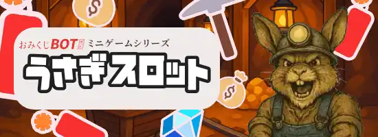

### うさぎスロット

> 発動ワード : `うさぎ` / `ウサギ`/ `ドワーフ`/ `rabbit`/ `dwarf`/ `usagi`

- Nolimit City 「Fire in the Hole」 をイメージした、スロット風おみくじ。得点の高さを競います。
- うさぎ🐇が多いほど枚数獲得の期待大！
  - にんじん🥕が出るほど、うさぎが増える傾向にあります。雇ったのかな？
- コイン🪙、お札💴、ドル袋💰️、ダイヤモンド💎、TNT🧨・ツルハシ⛏️が飛び出るほど高得点！
- 上限は 5000 枚。目指せジャックポット！

### スクリプトクエリ チートシート

#### mode

- **効果**
  - ツルハシ：ツルハシによるポイント増加が期待できます
  - TNT：TNT によるポイント増加が期待できます
  - ツルハシ TNT：ツルハシと TNT による相乗効果で爆発的なポイント増加が期待できます
- **指定例**
  - mode=ツルハシ
  - mode=TNT
  - mode=ツルハシ TNT
