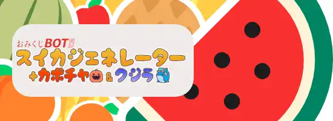

### スイカジェネレーター

> 発動ワード : `suika` / `すいか`/ `スイカ`/ `西瓜`/ `suica`

- 米兜科技「合成大西瓜」 または Aladdin X「スイカゲーム」風のおみくじ。得点の高さを競います。
- たくさんのフルーツが降ってきます（おみくじ BOT 用 WordParty の導入を忘れずに！）
  - 特に操作は必要ありません。また、くっついたフルーツはシンカしません（演出です）
- 高得点時、スイカが大量に降ってきます！

### カボチャジェネレーター

> 発動ワード : `かぼちゃ` / `カボチャ`/ `南瓜`/ `pumpkin`

- Aladdin X「スイカゲーム」風のおみくじ。得点の高さを競います。
- スイカジェネレーターの亜種。アメ🍬とカボチャ🎃が追加。出現するほど得点も高くなる！？
- カボチャは激アツ！10000 点も夢じゃない！？

### クジラジェネレーター

> 発動ワード : `くじら` / `クジラ`/ `鯨`/ `whale`

- NekokujiraLab「クジラゲームオンライン」風のおみくじ。得点の高さを競います。
- スイカ・カボチャとは異なる、ハイリスク＆ハイリターンなモード。
- 高得点時はクジラたちがたくさん！いたずらシャチにはご用心。

### スクリプトクエリ チートシート

#### mode

- **効果**
  - スイカ：通常モードです
  - カボチャ：カボチャとアメが降ってきます。カボチャはアツい！
  - クジラ：フルーツの代わりにクジラたちが降ってきます。
- **指定例**
  - mode=ツルハシ
  - mode=TNT
  - mode=ツルハシ TNT
- 指定なしの場合は「スイカ」になります

#### life（ライフ）

- 範囲：1～99
- 特定のフルーツが降ると得点が加算されつつダメージを受けます。数値が増えるほど、得点が上がります。
- 指定例
  - life=9
  - life=1
  - spin=99
- 未指定
  - 3 固定です。

#### 複数指定（AND）

- mode=クジラ&life=9
- mode=カボチャ&life=9
