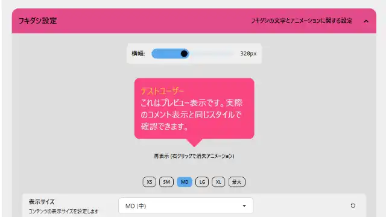

# おみくじ BOT クッキーカウンター OmikujiBot CookieCounter README

最終更新日：2026/04/04

配信者のためのコメントアプリ「わんコメ」で使用できる、 テンプレートです。

この内容は、BOOTH で配布している、以下の readme となります。

- [おみくじ BOT 桜カウンターツイン OmikujiBot SakuraCounter](https://pintocuru.booth.pm/items/AAAAAAAAAA)

## はじめに（Intro）

- [わんコメ](https://onecomme.com/) の機能を前提としたソフトウェアです。
- 本ソフトウェアの利用は自己責任でお願いいたします。
- 仕様は予告なく変更される場合があります。

## このテンプレートは何？（Features）

### 高評価も！コメント数も！いろいろカウントできる多機能カウンターテンプレート

- わんコメと連携して動作する【おみくじ BOT】を利用した、配信の気になる数値を表示するカウンターテンプレートです。
- ライブ配信で気になる、高評価・同時接続数はもちろん、チャットのコメント数や、コメントを残したユーザー数も数えてくれます。
  - 表示できる数値は以下の通り。
  - 初見さん
  - ユーザー数
  - 高評価
  - 同時接続数
  - 配信でのコメント数
  - 全ユーザーのコメント累計
  - ギフト金額（配信の合計）
  - 登録者数
  - リアクション数 (Youtube のみ)

### シーン別・活用例

- **すべての配信に**
  - 画面の隅に設置することで、視聴者の盛り上がりが数字で見えるようになり、配信が賑やかになります。

## インストール (Installation)

1. [テンプレートのインストール方法](https://github.com/Pintocuru/OmikenReadme/blob/main/docs/TemplateInstall/README.md)
2. [おみくじ BOT のアップグレード](https://github.com/Pintocuru/OmikujiBot-Docs/blob/main/template/installation/Installation_52_VersionUp.md)
3. [【推奨】おみくじ BOT 演出用 WordParty2.0 の導入方法](https://github.com/Pintocuru/OmikujiBot-Docs/blob/main/core/OmikenWordParty/README.md#%E3%82%A4%E3%83%B3%E3%82%B9%E3%83%88%E3%83%BC%E3%83%AB%E6%96%B9%E6%B3%95-installation)
	- [おみくじ BOT 演出用 WordParty2.0 とは?](https://github.com/Pintocuru/OmikujiBot-Docs/blob/main/core/OmikenWordParty/README.md#%E3%81%93%E3%81%AE%E3%83%86%E3%83%B3%E3%83%97%E3%83%AC%E3%83%BC%E3%83%88%E3%81%AF%E4%BD%95features)
4. [おみくじBOT コンフィグエディター PRO (有料版) のご案内](https://github.com/Pintocuru/OmikujiBot-Docs/blob/main/template/installation/Installation_51_ProUpgradeTemplate.md)

## つかいかた (Usage)

### クッキーカウンター

- 配信の気になる数値を表示する、多機能なカウンターです
- ライブ配信では気になる、高評価・同時接続数はもちろん、チャットのコメント数や、コメントを残したユーザー数も数えてくれます
	- 初見さん、ユーザー数、高評価、同時接続数、コメント数、ギフト金額 (配信の合計)、フォロワー数の 7 つです
- チャットから「特定のワード」を指定することで、そのカウントも行ってくれます。

## カスタマイズ（Customization）

### 「コンフィグエディター」で自由におみくじを編集できる

- 一部の配布パッケージには、**コンフィグエディター**（おみくじデータ編集用アプリ）が付属しています。
	- 付属されていない場合、新しく導入する必要があります。[コンフィグエディターの新規導入](https://github.com/Pintocuru/OmikujiBot-Docs/blob/main/template/installation/Installation_52_VersionUp.md) をご覧ください。
- アプリと同じフォルダにある **`ConfigMaker.html`** を開くと起動できます。
- 詳しくは [おみくじ BOT コンフィグエディター README](https://github.com/Pintocuru/OmikujiBot-Docs/blob/main/core/ConfigEditor/README.md) をご覧ください。

## よくある質問 (FAQ)

> わんコメの機能については [よくある質問](https://onecomme.com/docs/faq) または [導入ガイド](https://onecomme.com/docs/guide) をご参照ください。

### 発動条件・制限設定

- [Q. ギフト・スパチャされた時にだけ発動させたい](https://github.com/Pintocuru/OmikujiBot-Docs/blob/main/template/faq/21_LimitEdit/faq_2101_Gift.md)
- [Q. メンバー限定で発動させたい](https://github.com/Pintocuru/OmikujiBot-Docs/blob/main/template/faq/21_LimitEdit/faq_2102_Member.md)
- [Q. 1 日 1 回と、回数を制限したい](https://github.com/Pintocuru/OmikujiBot-Docs/blob/main/template/faq/21_LimitEdit/faq_2103_Limit.md)
- [Q. 同じ人に何回もおみくじされると困る](https://github.com/Pintocuru/OmikujiBot-Docs/blob/main/template/faq/21_LimitEdit/faq_2106_LimitOne.md)
- [Q. 配信者をおみくじから外すには？](https://github.com/Pintocuru/OmikujiBot-Docs/blob/main/template/faq/21_LimitEdit/faq_2104_Owner.md)
- [Q. 特定のおみくじを、一時的にオフにしたい](https://github.com/Pintocuru/OmikujiBot-Docs/blob/main/template/faq/21_LimitEdit/faq_2105_OffOmikuji.md)
- [Q. 特定のユーザーを制限したい](https://github.com/Pintocuru/OmikujiBot-Docs/blob/main/template/faq/21_LimitEdit/faq_2107_LimitOther.md)

### フキダシ・キャラクター表示関連

> キャラクターに関する扱いについては、各パッケージごとに異なります。

- [Q. フキダシの色を変更したい](https://github.com/Pintocuru/OmikujiBot-Docs/blob/main/template/faq/22_Character/faq_2201_BubbleColor.md)
- [Q. キャラクターを表示したい / キャラクターを消してフキダシだけにしたい](https://github.com/Pintocuru/OmikujiBot-Docs/blob/main/template/faq/22_Character/faq_2202_BubbleOnly.md)
- [Q. 右下のアイコンを消したい](https://github.com/Pintocuru/OmikujiBot-Docs/blob/main/template/faq/22_Character/faq_2203_Thumbnail.md)
- [Q. トーストを左側から出したい](https://github.com/Pintocuru/OmikujiBot-Docs/blob/main/template/faq/22_Character/faq_2204_ToastLeft.md)
- [Q. 文字やキャラクターのサイズを調整したい](https://github.com/Pintocuru/OmikujiBot-Docs/blob/main/template/faq/22_Character/faq_2205_FontBig.md)
- [Q. 自前のキャラクター画像を追加したい](https://github.com/Pintocuru/OmikujiBot-Docs/blob/main/template/faq/22_Character/faq_2206_MyCharacter.md)
- [Q. おみくじ結果で表示されるキャラクター・アイコンを変更したい](https://github.com/Pintocuru/OmikujiBot-Docs/blob/main/template/faq/22_Character/faq_2207_CharacterChange.md)
- [Q. ジェネレーターで表示するキャラクターを変更する](https://github.com/Pintocuru/OmikujiBot-Docs/blob/main/template/faq/22_Character/faq_2208_AlwaysCharacter.md)

### おみくじ内容・確率設定（コンテンツ編集）

- [Q. おみくじの内容を変更したい](https://github.com/Pintocuru/OmikujiBot-Docs/blob/main/template/faq/23_OmikujiEdit/faq_2301_OmikujiValue.md)
- [Q. おみくじが出てくる確率を変更したい](https://github.com/Pintocuru/OmikujiBot-Docs/blob/main/template/faq/23_OmikujiEdit/faq_2302_Omikujilottery.md)
- [Q. エディターで、おみくじの動作を確認するには](https://github.com/Pintocuru/OmikujiBot-Docs/blob/main/template/faq/23_OmikujiEdit/faq_2303_OmikujiConfirmation.md)
- [Q. プレースホルダーでおみくじのバリエーションを増やす](https://github.com/Pintocuru/OmikujiBot-Docs/blob/main/core/ConfigEditor/sub/ContentPlaceholder.md)
- [Q. プレースホルダー チートシート](https://github.com/Pintocuru/OmikujiBot-Docs/blob/main/core/ConfigEditor/sub/ContentPlaceholderCheatSheet.md)
- [Q. 評価ブロック (変数プレースホルダー)とは](https://github.com/Pintocuru/OmikujiBot-Docs/blob/main/core/ConfigEditor/sub/VariablePlaceholder.md)
- [Q. 評価ブロック (変数プレースホルダー) チートシート](https://github.com/Pintocuru/OmikujiBot-Docs/blob/main/core/ConfigEditor/sub/VariablePlaceholderCheatSheet.md)
- [Q. おみくじ表示時にサウンドを鳴らす](https://github.com/Pintocuru/OmikujiBot-Docs/blob/main/template/faq/23_OmikujiEdit/faq_2304_OmikujiSound.md)
- [Q. おみくじ表示時にWordpartyを鳴らす](https://github.com/Pintocuru/OmikujiBot-Docs/blob/main/template/faq/23_OmikujiEdit/faq_2305_OmikujiWordparty.md)

## トラブルシューティング (Troubleshooting)

わんコメの機能については [トラブルシューティング](https://onecomme.com/docs/trouble-shooting) または [導入ガイド](https://onecomme.com/docs/guide) をご参照ください。

### 設定・表示・音声関連

- [Q. OBS 側で非表示にしていても、BOT のコメントが勝手に動いてしまう](https://github.com/Pintocuru/OmikujiBot-Docs/blob/main/template/troubleshooting/12_infoOmikujiBot/trouble_1202_OBSSound.md)
- [Q. キャラクター画像が表示されない](https://github.com/Pintocuru/OmikujiBot-Docs/blob/main/template/troubleshooting/12_infoOmikujiBot/trouble_1203_CharacterImage.md)
- [Q. WordParty の音が配信に出ない](https://github.com/Pintocuru/OmikujiBot-Docs/blob/main/template/troubleshooting/12_infoOmikujiBot/trouble_1206_infoWordParty.md)

### おみくじ関連

- [Q. コメントでおみくじが反応しない](https://github.com/Pintocuru/OmikujiBot-Docs/blob/main/template/troubleshooting/12_infoOmikujiBot/trouble_1204_CommentOmikuji.md)
- [Q. おみくじが Youtube のコメントに反映されていない](https://github.com/Pintocuru/OmikujiBot-Docs/blob/main/template/troubleshooting/12_infoOmikujiBot/trouble_1205_OmikujiPlatform.md)

## クレジット（Credits）

### 効果音・ジングル

- [効果音・ジングルに関するライセンス](https://github.com/Pintocuru/OmikujiBot-Docs/blob/main/core/OmikujiBot/sub/sounds.md) にまとめています。
  - このアプリ（ジェネレーター・エディター）に収録されている効果音データは、すべて [CC0 1.0](https://creativecommons.org/publicdomain/zero/1.0/) です。

## ライセンス（License）

### パッケージデータ

- このパッケージのデータ (JSON データ) は、改変・再利用は自由に行えます。
- ただし **再配布は禁止** とします。
- 本テンプレートの使用に伴ういかなる損害についても責任を負いません。ご利用は自己責任でお願いします。

### アプリ本体（ジェネレーター・コンフィグエディター）

- Copyright © 2023-2026 Pintocuru(せすじピンとしてます)
- 本ソフトウェア (おみくじ BOT) は、著作権者の許可なく再配布することを禁じます。
- 本ソフトウェアは、Github、または BOOTH にて提供される各パッケージに含まれる形でのみ配布されます。
- 改変・逆コンパイル・再販売も禁止されています。

## バージョン情報 (Version)

### ver.260404

- **おみくじ BOT のバージョン**: v2.12.0
- 新規作成

---

作成者：Pintocuru(せすじピンとしてます) @pintocuru

[Twitter](https://twitter.com/pintocuru) | [YouTube](https://www.youtube.com/@pintocuru)

<%* await tp.user.expandEmbeds(tp,'ja') %>