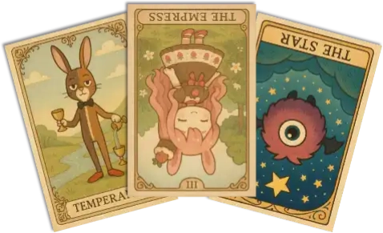
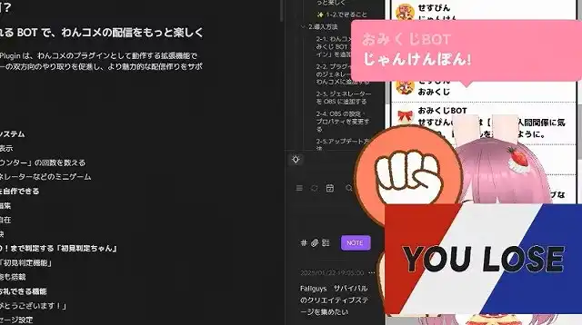
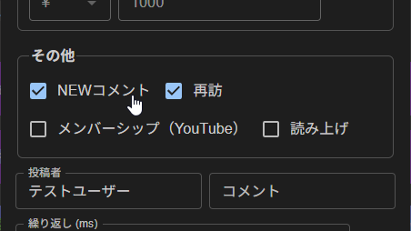

# おみくじ BOT ストロベリーショコラ OmikujiBot StrawberryChocolate README

最終更新日：2026/02/18

配信者のためのコメントアプリ「わんコメ」で使用できる、 テンプレートです。

この内容は、BOOTH で配布している、 [おみくじBOT ストロベリーショコラ OmikujiBot StrawberryChocolate](https://pintocuru.booth.pm/items/7733810) の readme となります。

## はじめに（Intro）

- [わんコメ](https://onecomme.com/) の機能を前提としたソフトウェアです。
- 本ソフトウェアの利用は自己責任でお願いいたします。
- 仕様は予告なく変更される場合があります。

## このテンプレートは何？（Features）

### わんコメに BOT 機能を付与するジェネレーター

- 【おみくじ BOT OmikujiBot】は、わんコメに BOT 機能を付与するジェネレーターです。
- 特定のワード (おみくじ 等) と、チャットに投稿することで、ランダムな結果を配信画面に表示します。
- 初見さん (初めてのコメント) や、通算 100 回目のコメントなど、特定の条件で発動し、配信画面に表示する機能があります。
- ピンとくる企画のオリジナルキャラクター「ストロベリーショコラ」を BOT キャラクターにしました。
  - 世話好きでお姉さんらしい雰囲気を持ち、甘く丁寧な接客が魅力です。

### シーン別・活用例

- **朝活配信**
  - 今日 1 日の運勢を占う「おみくじ」で、配信が賑やかに。
- **雑談配信**
  - リスナーのコメントに対してキャラクターがボケたりツッコミを入れたりして、自然に会話が広がります。
- **ゲーム配信**
  - ゲームに集中していても、BOT が代わりに挨拶してくれるので、初見さんを見逃しません。

### ストロベリーショコラのキャラクター設定

- **性格**
  - 世話好きで面倒見がよく、困っている人を見ると放っておけないタイプ。
  - お姉さんらしい落ち着きと包容力を持ち、相手を安心させる雰囲気があります。
- **口調**
  - 丁寧で柔らかい言葉遣いが基本。
  - 相手を優しく包み込むようなトーンで話し、時折ユーモアを交えて場を和ませます。
  - 呼びかけは「〜さん」と親しみを込めつつ、少し甘えさせてくれるようなニュアンスを持っています。
    - 悪いことをすると「～ちゃん」とからかうことも？

## インストール (Installation)

1. [テンプレートのインストール方法](https://github.com/Pintocuru/OmikenReadme/blob/main/docs/TemplateInstall/README.md)
2. [おみくじ BOT のアップグレード](https://github.com/Pintocuru/OmikujiBot-Docs/blob/main/template/installation/Installation_52_VersionUp.md)
3. [【推奨】おみくじ BOT 演出用 WordParty2.0 の導入方法](https://github.com/Pintocuru/OmikujiBot-Docs/blob/main/core/OmikenWordParty/README.md#%E3%82%A4%E3%83%B3%E3%82%B9%E3%83%88%E3%83%BC%E3%83%AB%E6%96%B9%E6%B3%95-installation)
   - [おみくじ BOT 演出用 WordParty2.0 とは?](https://github.com/Pintocuru/OmikujiBot-Docs/blob/main/core/OmikenWordParty/README.md#%E3%81%93%E3%81%AE%E3%83%86%E3%83%B3%E3%83%97%E3%83%AC%E3%83%BC%E3%83%88%E3%81%AF%E4%BD%95features)
4. [おみくじBOT コンフィグエディター PRO (有料版) のご案内](https://github.com/Pintocuru/OmikujiBot-Docs/blob/main/template/installation/Installation_51_ProUpgradeTemplate.md)

## つかいかた (Usage)

### おみくじを発動させるには

- 配信で実際に使う前に、**わんコメのコメントテスターで動作確認**することをおすすめします。
- コメントテスターは、わんコメのメニューから「コメントテスター」を選択してご利用ください。
- OBS 等のストリーミング配信アプリに正しく導入されていれば、コメントに「おみくじ」などのキーワードを送信することで発動します。

### 巫女さんのおみくじ (ノーマル)

> 発動ワード : `おみくじ` / `omikuji` / `みくじ` / `御神籤` / `運勢`

- あの " 有名な巫女さん " 手製の、真面目なおみくじ。
- 大吉・吉・中吉・小吉・末吉・凶・大凶が入っているよ。

### タロットカード

> 発動ワード : `タロット` / `タロットカード`/ `tarot`

- 使用するカードは、大アルカナ 22 枚。正位置・逆位置を含めた全 44 種類の結果が用意されています。
  - カードの意味はしっかり本格派。軽い気持ちで引いても、ふと心に残るかも。
  - [おみくじ BOT 用 WordParty](https://booth.pm/ja/items/6048048) を一緒に導入すると、稼働時にアニメーションが入ります。

- タロットに描かれているキャラクターは「おみくじ BOT」のキャラクターです。左から下記のような名前です。
  - カペラテ＝フロート
  - ストロベリーショコラ
  - マモノ (アサイーボール)

### じゃんけん

> 発動ワード : `じゃんけん` / `janken`/ `グー`/ `チョキ`/ `パー`

- じゃんけんの勝率は 1/2、あいこを「負け」とカウントしても、1/3 だと考えていませんか。
- この「じゃんけん」は、じゃんけんの猛者 [「ケイスケ ホンダ」](https://dic.pixiv.net/a/%E6%9C%AC%E7%94%B0%E3%81%A8%E3%81%98%E3%82%83%E3%82%93%E3%81%91%E3%82%93) を導入することにより、勝率をたったの 5% まで劇的に減少させることに成功しました。
- じゃんけんの猛者、降臨！激戦を制するのは誰だ！！
  - 誰が勝つか、ユーザー同士で競い合え、コメント数も増加します。
  - [勝ったらコーラ1本プレゼント](https://www.j-cast.com/2019/04/17355553.html)…も夢じゃない!?

### 初見判定ちゃん

> 発動条件 : 初回コメント

- 初めてのコメント、久しぶり（約 1 週間ぶり）、その配信での初回コメントに対して挨拶します。
  - 判定には「わんコメ」のデータを参照します。
  - そのため、実際には「初見」でなくても、データにユーザー情報がなければ「初見」と判定されます。ご了承ください。
- 初見でもないのに「初見」とコメントすると…？

#### コメントテスターでのテスト方法

- おみくじ BOT v1.2 以降では、コメントテスターの「その他」項目から以下にチェックを入れることで「初見判定ちゃん」のテストが可能です。
  - `NEWコメント` : 初見
  - `NEWコメント` + `再訪` : 久しぶり（前回コメントから 1 週間以上経過）
  - `再訪` : 配信枠での初回コメント

#### 初見詐欺

> 発動ワード : `初見(?!さん)` / `所見`/ `はじめまして`
> 発動条件 : 個人コメント数 (総数) が 6 以上であるとき

- 実際には初見でないのに「初見」とコメントしたユーザーに対して、ツッコミで返答します。
  - コメント数が 5 回以下の場合は、許容バージョンとして「ホントの初見」というデータも用意しています。
- 複数アカウントを利用している場合など、同一人物であってもアカウントが異なる場合、わんコメでは区別できないため、「初見」と判定されてしまいます。

### ギフトのお礼

> 発動条件 : 1 ポイント以上のスパチャ・ギフト・ビット・お茶爆等

- ギフトに対して、BOT コメントを表示することが出来ます。
- ギフトに対するリアクションは、わんコメのギフト用読み上げ機能や、 WordPatry 機能で様々な演出が可能なので、控えめに設定しています。

### コメント数チェック (配信内・個人総合)

> 発動条件 : 配信内で 50 コメント毎、個人で 100 コメント毎

- 配信内でのコメント数と、個人の総合コメント数を参照して、特定の回数で BOT がコメントしてくれます。
- デフォルトでは、50 回、または 100 回ごとにお知らせのトースト表示をしてくれます。

### コメント数を確認する

> 発動ワード : `コメント`

- これまでに投稿したコメント数を、わんコメが起動していた配信枠の範囲でカウントし、結果をトースト通知で表示します。

## PRO 版ボーナスデータ (Usage)

配信で盛り上がる！ミニゲームシリーズが同梱されています。

### スイカジェネレーター

> 発動ワード : `suika` / `すいか`/ `スイカ`/ `西瓜`/ `suica`

- 米兜科技「合成大西瓜」 または Aladdin X「スイカゲーム」風のおみくじ。得点の高さを競います。
- たくさんのフルーツが降ってきます（おみくじ BOT 用 WordParty の導入を忘れずに！）
  - 特に操作は必要ありません。また、くっついたフルーツはシンカしません（演出です）
- 高得点時、スイカが大量に降ってきます！

### カボチャジェネレーター

> 発動ワード : `かぼちゃ` / `カボチャ`/ `南瓜`/ `pumpkin`

- Aladdin X「スイカゲーム」風のおみくじ。得点の高さを競います。
- スイカジェネレーターの亜種。アメ🍬とカボチャ🎃が追加。出現するほど得点も高くなる！？
- カボチャは激アツ！10000 点も夢じゃない！？

### クジラジェネレーター

> 発動ワード : `くじら` / `クジラ`/ `鯨`/ `whale`

- NekokujiraLab「クジラゲームオンライン」風のおみくじ。得点の高さを競います。
- スイカ・カボチャとは異なる、ハイリスク＆ハイリターンなモード。
- 高得点時はクジラたちがたくさん！いたずらシャチにはご用心。

### ボンバースロット

> 発動ワード : `スロット` / `すろっと`/ `slot`/ `ボンバー`/ `bomber`

- APPLI 「BOMBERSPIN2」 をイメージした、スロット風おみくじ。得点の高さを競います。
- ランクの高い図柄ほど高い得点に期待が持てます。
- 図柄は「チェリー」「オレンジ」「ぶどう」「スイカ」「ベル」「ハット」「コイン」「ダイヤモンド」の 8 つ。
  - 使える絵文字の関係上、プラム→ぶどう、BAR→コイン、セブン→ダイヤモンド に変更しています。
  - 「ダブルダウン」はありません。
- 突然の高得点！後半になるほど、高い得点が得られます。

### うさぎスロット

> 発動ワード : `うさぎ` / `ウサギ`/ `ドワーフ`/ `rabbit`/ `dwarf`/ `usagi`

- Nolimit City 「Fire in the Hole」 をイメージした、スロット風おみくじ。得点の高さを競います。
- うさぎ🐇が多いほど枚数獲得の期待大！
  - にんじん🥕が出るほど、うさぎが増える傾向にあります。雇ったのかな？
- コイン🪙、お札💴、ドル袋💰️、ダイヤモンド💎、TNT🧨・ツルハシ⛏️が飛び出るほど高得点！
- 上限は 5000 枚。目指せジャックポット！

### 桜吹雪スロット

> 発動ワード : `さくら` / `桜`/ `sakura`/ `桜吹雪`

- Wing 「FURAIJIN 風雷神」 をイメージした、スロット風おみくじ。得点の高さを競います。
- 図柄は「10(雨⛈️)」「J(月🌙)」「Q(竹🎍)」「K(波🌊)」「ACE(桜🌸)」「SSR(星🌟)」の 6 種類。
- 配当は非常に低いですが、掛け算により、指数的に得点が跳ね上がります。
- 花火が打ち上がるほど枚数獲得の期待大！
  - 枚数が多いほど、風神や雷神の出現率が上がります。
  - 上限達成で特別なキャラクターも…？
- 上限は 5000 枚。目指せジャックポット！

## カスタマイズ（Customization）

### 「コンフィグエディター」で自由におみくじを編集できる

- 一部の配布パッケージには、**コンフィグエディター**（おみくじデータ編集用アプリ）が付属しています。
  - 付属されていない場合、新しく導入する必要があります。[コンフィグエディターの新規導入](https://github.com/Pintocuru/OmikujiBot-Docs/blob/main/template/installation/Installation_52_VersionUp.md) をご覧ください。
- アプリと同じフォルダにある **`ConfigMaker.html`** を開くと起動できます。
- 詳しくは [おみくじ BOT コンフィグエディター README](https://github.com/Pintocuru/OmikujiBot-Docs/blob/main/core/ConfigEditor/README.md) をご覧ください。
- おみくじの内容は、あなたの配信に合わせて**内容を自由にカスタマイズ**できます。
- ただし、使用している**キャラクターには著作権があります**ので、原作やイラスト制作者の方々へのご配慮をお願いします。

## よくある質問 (FAQ)

> わんコメの機能については [よくある質問](https://onecomme.com/docs/faq) または [導入ガイド](https://onecomme.com/docs/guide) をご参照ください。

### 発動条件・制限設定

- [Q. ギフト・スパチャされた時にだけ発動させたい](https://github.com/Pintocuru/OmikujiBot-Docs/blob/main/template/faq/21_LimitEdit/faq_2101_Gift.md)
- [Q. メンバー限定で発動させたい](https://github.com/Pintocuru/OmikujiBot-Docs/blob/main/template/faq/21_LimitEdit/faq_2102_Member.md)
- [Q. 1 日 1 回と、回数を制限したい](https://github.com/Pintocuru/OmikujiBot-Docs/blob/main/template/faq/21_LimitEdit/faq_2103_Limit.md)
- [Q. 同じ人に何回もおみくじされると困る](https://github.com/Pintocuru/OmikujiBot-Docs/blob/main/template/faq/21_LimitEdit/faq_2106_LimitOne.md)
- [Q. 配信者をおみくじから外すには？](https://github.com/Pintocuru/OmikujiBot-Docs/blob/main/template/faq/21_LimitEdit/faq_2104_Owner.md)
- [Q. 特定のおみくじを、一時的にオフにしたい](https://github.com/Pintocuru/OmikujiBot-Docs/blob/main/template/faq/21_LimitEdit/faq_2105_OffOmikuji.md)
- [Q. 特定のユーザーを制限したい](https://github.com/Pintocuru/OmikujiBot-Docs/blob/main/template/faq/21_LimitEdit/faq_2107_LimitOther.md)

### フキダシ・キャラクター表示関連

> キャラクターに関する扱いについては、各パッケージごとに異なります。

- [Q. フキダシの色を変更したい](https://github.com/Pintocuru/OmikujiBot-Docs/blob/main/template/faq/22_Character/faq_2201_BubbleColor.md)
- [Q. キャラクターを表示したい / キャラクターを消してフキダシだけにしたい](https://github.com/Pintocuru/OmikujiBot-Docs/blob/main/template/faq/22_Character/faq_2202_BubbleOnly.md)
- [Q. 右下のアイコンを消したい](https://github.com/Pintocuru/OmikujiBot-Docs/blob/main/template/faq/22_Character/faq_2203_Thumbnail.md)
- [Q. トーストを左側から出したい](https://github.com/Pintocuru/OmikujiBot-Docs/blob/main/template/faq/22_Character/faq_2204_ToastLeft.md)
- [Q. 文字やキャラクターのサイズを調整したい](https://github.com/Pintocuru/OmikujiBot-Docs/blob/main/template/faq/22_Character/faq_2205_FontBig.md)
- [Q. 自前のキャラクター画像を追加したい](https://github.com/Pintocuru/OmikujiBot-Docs/blob/main/template/faq/22_Character/faq_2206_MyCharacter.md)
- [Q. おみくじ結果で表示されるキャラクター・アイコンを変更したい](https://github.com/Pintocuru/OmikujiBot-Docs/blob/main/template/faq/22_Character/faq_2207_CharacterChange.md)
- [Q. ジェネレーターで表示するキャラクターを変更する](https://github.com/Pintocuru/OmikujiBot-Docs/blob/main/template/faq/22_Character/faq_2208_AlwaysCharacter.md)

### おみくじ内容・確率設定（コンテンツ編集）

- [Q. おみくじの内容を変更したい](https://github.com/Pintocuru/OmikujiBot-Docs/blob/main/template/faq/23_OmikujiEdit/faq_2301_OmikujiValue.md)
- [Q. おみくじが出てくる確率を変更したい](https://github.com/Pintocuru/OmikujiBot-Docs/blob/main/template/faq/23_OmikujiEdit/faq_2302_Omikujilottery.md)
- [Q. エディターで、おみくじの動作を確認するには](https://github.com/Pintocuru/OmikujiBot-Docs/blob/main/template/faq/23_OmikujiEdit/faq_2303_OmikujiConfirmation.md)
- [Q. プレースホルダーでおみくじのバリエーションを増やす](https://github.com/Pintocuru/OmikujiBot-Docs/blob/main/core/ConfigEditor/sub/ContentPlaceholder.md)
- [Q. プレースホルダー チートシート](https://github.com/Pintocuru/OmikujiBot-Docs/blob/main/core/ConfigEditor/sub/ContentPlaceholderCheatSheet.md)
- [Q. 変数プレースホルダーとは](https://github.com/Pintocuru/OmikujiBot-Docs/blob/main/core/ConfigEditor/sub/VariablePlaceholder.md)
- [Q. 変数プレースホルダー チートシート](https://github.com/Pintocuru/OmikujiBot-Docs/blob/main/core/ConfigEditor/sub/VariablePlaceholderCheatSheet.md)
- [Q. おみくじ表示時にサウンドを鳴らす](https://github.com/Pintocuru/OmikujiBot-Docs/blob/main/template/faq/23_OmikujiEdit/faq_2304_OmikujiSound.md)
- [Q. おみくじ表示時にWordpartyを鳴らす](https://github.com/Pintocuru/OmikujiBot-Docs/blob/main/template/faq/23_OmikujiEdit/faq_2305_OmikujiWordparty.md)

## トラブルシューティング (Troubleshooting)

わんコメの機能については [トラブルシューティング](https://onecomme.com/docs/trouble-shooting) または [導入ガイド](https://onecomme.com/docs/guide) をご参照ください。

### 設定・表示・音声関連

- [Q. OBS 側で非表示にしていても、BOT のコメントが勝手に動いてしまう](https://github.com/Pintocuru/OmikujiBot-Docs/blob/main/template/troubleshooting/12_infoOmikujiBot/trouble_1202_OBSSound.md)
- [Q. キャラクター画像が表示されない](https://github.com/Pintocuru/OmikujiBot-Docs/blob/main/template/troubleshooting/12_infoOmikujiBot/trouble_1203_CharacterImage.md)
- [Q. WordParty の音が配信に出ない](https://github.com/Pintocuru/OmikujiBot-Docs/blob/main/template/troubleshooting/12_infoOmikujiBot/trouble_1206_infoWordParty.md)

### おみくじ関連

- [Q. コメントでおみくじが反応しない](https://github.com/Pintocuru/OmikujiBot-Docs/blob/main/template/troubleshooting/12_infoOmikujiBot/trouble_1204_CommentOmikuji.md)
- [Q. おみくじが Youtube のコメントに反映されていない](https://github.com/Pintocuru/OmikujiBot-Docs/blob/main/template/troubleshooting/12_infoOmikujiBot/trouble_1205_OmikujiPlatform.md)

## クレジット（Credits）

### ストロベリーショコラのイラスト

- pintocuru(せすじピンとしてます)
- 本アプリ専用に制作された素材です。他の用途での使用・転載・再配布は禁止します。

あたしのデータはサンプル用だから、自由に置き換えしてもらって結構よ♡

## ライセンス（License）

**このパッケージには、ライセンスの異なる複数の種類のデータが含まれています。**

### JSON データ

- 【CC-BY 4.0】 このパッケージのデータ (Json データ) は、 [Creative Commons Attribution 4.0 International (CC-BY 4.0)](https://creativecommons.org/licenses/by/4.0/) に基づいて提供されます。
- クレジット表記を行うことで、改変・再利用が可能です。

### 画像・イラスト等について

- パッケージに含まれる画像・イラスト等は **CC-BY 4.0 の対象外** です。
- これらは各権利者の許諾に基づき、**アプリ内での利用に限り同梱しているものです。**
- 抽出・再配布・単体利用は禁止されています。

### アプリ本体（ジェネレーター・コンフィグエディター）

- Copyright © 2023-2026 Pintocuru(せすじピンとしてます)
- 本ソフトウェア (おみくじ BOT) は、著作権者の許可なく再配布することを禁じます。
- 本ソフトウェアは、Github、または BOOTH にて提供される各パッケージに含まれる形でのみ配布されます。
- 改変・逆コンパイル・再販売も禁止されています。

## バージョン情報 (Version)

### ver.260217

- **おみくじ BOT のバージョン**: v2.1.0
- 「巫女さんのおみくじ (ノーマル)」を追加。
- 「メタイベント」機能追加により、高評価・視聴数増加で反応する、新しいおみくじが追加されています。
- 「簡易プレースホルダー」機能追加により、多くの部分で高機能プレースホルダーから変更されています。

### ver.260120

- **おみくじ BOT のバージョン**: v2.0.3
- 各おみくじのバリエーションを増やしました
- 新機能に合わせて一部データが変更されています
  - 最近までずっと「ずんだもん」のデータが残っていました…失礼しました

### ver.251206

- おみくじ BOT のバージョン: v1.4.3
- 「おみくじ BOT」のサンプルデータ、またはライセンス付きの PRO 版として新規作成
  - 今後のリリースは、このバージョンを唯一の PRO 版（ライセンスキー付き）にする予定です
  - 他のリリースは「通常版」のほかに「支援版」として提供する場合もありますが、ライセンスキーはこのバージョンのみです。

---

作成者：Pintocuru(せすじピンとしてます) @pintocuru

[Twitter](https://twitter.com/pintocuru) | [YouTube](https://www.youtube.com/@pintocuru)
