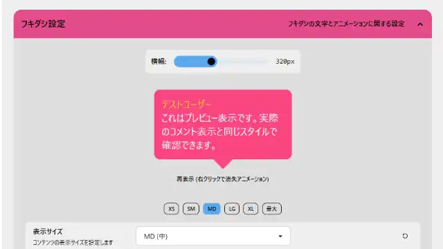

# おみくじ BOT コンフィグエディター OmikujiBot ConfigEditor

最終更新日：2025/09/09

配信者のためのコメントアプリ「わんコメ」で使用できる、 ジェネレーター BOT 「おみくじ BOT」のデータを編集できるアプリケーションです。

この内容は、BOOTH で配布している、 下記に同梱している 「コンフィグエディター」 の readme となります。

- [おみくじ BOT ゆっくり霊夢&魔理沙 OmikujiBot ReimuMarisa](https://pintocuru.booth.pm/items/5471598)
- [おみくじ BOT ずんだもん OmikujiBot Zundamon](https://pintocuru.booth.pm/items/6053855)
- [おみくじ BOT 高飛車な四国めたん OmikujiBot Diva Metan](https://pintocuru.booth.pm/items/6058829)
- おみくじ BOT ズッ友!つむぎ&ひまり OmikujiBot Tsumugi & Himari
- [どこでもドラちゃん Bot OmikujiBot 5percent_Dora](https://pintocuru.booth.pm/items/7291931)
- [スイカ 🍉 ジェネレーター Gousei Suika Generator](https://pintocuru.booth.pm/items/5813323)

## はじめに（Intro）

- [わんコメ](https://onecomme.com/) の機能を前提としたソフトウェアです。
- 本ソフトウェアの利用は自己責任でお願いいたします。
- 仕様は予告なく変更される場合があります。

## このアプリは何？（Features）

### おみくじ BOT を少しだけ自分好みに設定できる専用エディター

【おみくじ BOT コンフィグエディター OmikujiBot ConfigEditor】は、[おみくじ BOT](../../core/OmikujiBot/README.md) 専用のエディターです。おみくじの内容や演出を、直感的にカスタマイズできます。

1. **おみくじの確率や制限が自由に行える**
   - おみくじの内容や、演出のタイミングを自由に変更可能
   - 出現確率も 0.01% 単位で表示可能、パチスロのような 1/65536 にも
   - 発動条件を自由に設定（例：「メンバー限定」「ギフトしたユーザーのみ」）
   - 引ける回数を制限（例：1 日 1 回、連投制限）
2. **多彩なおみくじ結果をサポートする「プレースホルダー」機能**
   - 抽選の重さを使った簡易設定から、プレースホルダー機能を使った高度なおみくじまで対応
   - 最大 1000 通り以上の結果を持つおみくじも簡単に作成
   - プレースホルダー設定の「テキストモード」で、大量データ（約 1000 行）も楽に入力
3. **シンプルにも賑やかにもできるキャラクター関連**
   - フキダシ色やアニメーションの変更、エディター内で動作確認
   - カラーテンプレートも用意してます
   - キャラクター画像の指定（自作画像の使用も可能）
   - キャラクターごとに読み上げを変えられる、補助機能
4. **管理のしやすいおみくじ**
   - おみくじの抽選テストや演出確認機能
   - カラー分類でおみくじを整理管理
5. **便利機能・PRO 版限定**
   - WordParty のポン出し機能
   - PRO 版では「テンプレート出力」が可能（特定条件で配布も可能）

## インストール (Installation)

- コンフィグエディターは、各種おみくじ BOT のパッケージに付属しています。
- [おみくじ BOT ゆっくり霊夢&魔理沙 OmikujiBot ReimuMarisa](https://pintocuru.booth.pm/items/5471598)
- [おみくじ BOT ずんだもん OmikujiBot Zundamon](https://pintocuru.booth.pm/items/6053855)
- [おみくじ BOT 高飛車な四国めたん OmikujiBot Diva Metan](https://pintocuru.booth.pm/items/6058829)
- おみくじ BOT ズッ友!つむぎ&ひまり OmikujiBot Tsumugi & Himari
- [どこでもドラちゃん Bot OmikujiBot 5percent_Dora](https://pintocuru.booth.pm/items/7291931)
- [スイカ 🍉 ジェネレーター Gousei Suika Generator](https://pintocuru.booth.pm/items/5813323)

## アップグレード (Installation)

アップグレードは [github](https://github.com/Pintocuru/OmikujiBot-Docs/releases/latest) にて配布しております。

- **アップグレード手順**：
  1. リリースノートの下部にある「Assets」から、「OmikujiBot」と書かれたファイルをダウンロード
  2. ダウンロードしたファイルを解凍
  3. わんコメを開き、「テンプレート」画面から、アップグレードしたいテンプレートを選び、右側の「フォルダを開く」をクリック
  4. 念のため、フォルダ内の `omikujiData.js` を別の場所にバックアップ
  5. 解凍したファイルを、該当フォルダに上書き保存
  6. コンフィグエディターを起動し、バージョンが最新になっていることを確認
- **注意**：アップグレード後、一部設定がデフォルトに戻る場合があります。

### PRO 版へのアップグレード方法

- PRO 版は以下の機能が追加されます
	- 「テンプレートの読み込み・出力」が可能になります。
	- フキダシのフォント設定・アニメーション設定を自在に選べるようになります。
- PRO 版をご購入いただくと、配布ファイル内の `readme.txt` にライセンスキーが記載されています。
- コンフィグエディターの「表示設定 ＞ エディター設定」に、ライセンスキーを入力する欄がありますので、そこへコピー＆ペーストしてください。

## つかいかた (Usage)

おみくじデータに関する設定方法は、それぞれエディターに詳細が書かれています。機能が多岐にわたるため、すべてをこの README に記載することはしていません。

**基本的な使い方のヒント**：
- エディターを開くと、各項目にツールチップや説明が表示されます
- 設定項目は直感的に操作できるように設計されています

### 【重要】 設定の保存方法

仕様上、コンフィグエディターは途中の保存が行えません。閉じたりリロードすると内容が消えてしまうため、保存は注意深く行ってください。

**内容の反映のさせ方**

1. 「設定を出力 (js)」ボタンを押すと、ブラウザから「omikujiData.js」というファイルが保存されます。
2. コンフィグエディターと同じフォルダに、ダウンロードした「omikujiData.js」を上書き保存します。

### 【PRO 版】 テンプレート出力 (json)

テンプレートを JSON データとして書き出すことができます。

- バックアップ用途や、自作テンプレートの保存・共有にご利用いただけます
- 改変したデータの再配布については、**CC BY 4.0 ライセンス**に準じつつ、独自の制限が適用される場合があります。再配布の可否は各ファイル内のライセンス表記を必ずご確認ください。
- 一部のパッケージでは、テンプレート出力ができないよう、ライセンス記入項目をなくしています。

### 【PRO 版】 テンプレート読み込み (json)

配布されている JSON ファイルや、バックアップとして出力した JSON ファイルを読み込むことができます。

読み込み時には、適用するデータの範囲を選択できます：

- **すべてのデータを上書き** 既存のテンプレート設定をすべて削除し、JSON データを完全に適用します。
    - ライセンス情報を含む、すべての項目が上書きされます。
- **部分的な追加・上書き** Record データ（コメントルール・タイマールール・プレースホルダー・キャラクターデータ）に対して、以下の操作が可能です：
    - **置き換え**：既存データを削除して、新しいデータに差し替え
    - **マージ**：既存データに新しいデータを追加（重複は上書き）
    - このモードでは、ライセンス情報や一部の設定は上書きされません。

> 📝 読み込み前に、現在のテンプレートをバックアップしておくことをおすすめします。 読み込み後は、設定内容を確認し、必要に応じて微調整してください。

## よくある質問

### エディター関連

#### Q. このエディターで何が編集できる？

A. [おみくじ BOT](../../core/OmikujiBot/README.md) で表示させるおみくじ結果を編集できます。

#### Q. 元に戻す（Undo）はできる？

A. Undo 機能は付いていません。こまめに保存していただくようお願いします。

#### Q. 作成したデータを他の人と共有できますか？

A. 配布データをそのまま再配布することは禁止です。内容を編集し、配布データにない要素を付与した json データについては、配布できる場合があります。詳しくは Readme をお読み下さい。

#### Q. おみくじ BOT 用 WordParty を編集したい

#### Q. 最新のバージョンより古いデータで作成したファイルは読めますか？

## トラブルシューティング (Troubleshooting)

### Q. データを記入したのに、ジェネレーターに反映されていない

A. **このコンフィグエディターは、自動保存ではありません。** 保存ボタンを押し、出力されたファイルを上書きする方法で保存を行う必要があります。詳しくはつかいかた (Usage) の、【重要】 設定の保存方法をご覧ください。

### Q. ダイアログを出した時、一部表記が隠れる

### Q. エディターで記入したが反映されない、ボタンを押しても反応しない、等

A. 一部動作に不具合がある可能性があります。バグを見つけたら連絡ください。

## ライセンス（License）

### アプリ本体（ジェネレーター・コンフィグエディター）

- Copyright © 2025 Pintocuru(せすじピンとしてます)
- 本ソフトウェア (おみくじ BOT) は、著作権者の許可なく再配布することを禁じます。
- 本ソフトウェアは、BOOTH にて提供される各パッケージに含まれる形でのみ配布されます。
- 改変・逆コンパイル・再販売も禁止されています。

### パッケージデータ

パッケージごとにライセンス形態（商用利用可否・改変可否など）が異なります。詳しくは各パッケージの README または商品ページをご確認ください。

## バージョン情報

> 詳細な変更履歴は [Releases](https://github.com/Pintocuru/OmikujiBot-Docs/releases) をご覧ください。

## v1.1.0-rc2 25/09/09

- GOD-MODE(開発者向け):「ライセンス記入」の ON/OFF 機能を追加
    - 配布パッケージによっては、テンプレート出力をして欲しくないものもあるので、その対応です

作成者：せすじピンとしてます @pintocuru

[Twitter](https://twitter.com/pintocuru) | [YouTube](https://www.youtube.com/@pintocuru)