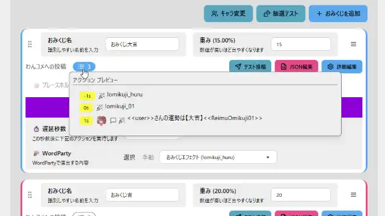
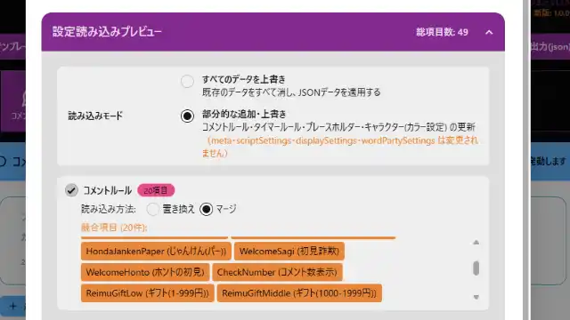

# おみくじ BOT コンフィグエディター OmikujiBot ConfigEditor

最終更新日：<% tp.date.now('YYYY/MM/DD') %>

 ジェネレーター BOT 「おみくじ BOT」のデータを編集できるアプリケーションです。

 下記に同梱している 「コンフィグエディター」 の readme となります。

## このアプリは何？（Features）

### おみくじ BOT を自分好みに設定できる専用エディター

【おみくじ BOT コンフィグエディター OmikujiBot ConfigEditor】は、[おみくじ BOT](https://github.com/Pintocuru/OmikujiBot-Docs/blob/main/core/OmikujiBot/README.md) 専用のエディターです。おみくじの内容や演出を、直感的にカスタマイズできます。

1. **おみくじの確率や制限が自由に行える**
   - おみくじの内容や、演出のタイミングを自由に変更可能
   - 出現確率も自由に設定可能、パチスロのような 1/65536 にも
   - 「メンバー限定」「ギフト」など、発動条件を自由に設定
   - 引ける回数を制限（例：1 日 1 回、連投制限）
2. **多彩なおみくじ結果をサポートする「プレースホルダー」機能**
   - 抽選の重さを使った簡易設定から、プレースホルダー機能を使った高度なおみくじまで対応
   - 1000 通り以上の複雑なおみくじも簡単に作成
   - プレースホルダー設定の「テキストモード」で、大量データも楽に入力
3. **フキダシのカラーやスタイルを変更できる**
   - フキダシ色やアニメーションの変更を、エディター内で動作確認
   - DaisyUi を使用した、可読性と装飾性を兼ねたカラーテンプレート
4. **シンプルにも賑やかにもできるキャラクター関連**
   - キャラクター画像が使えます。自作画像の使用も可能！
   - キャラクターごとに読み上げを変えられます
5. **PRO 版限定機能**
   - 「テンプレート出力」が可能（特定条件で配布も可能）
   - プラグインを使うことで、複数のデータを管理可能

## インストール (Installation)

### [1. おみくじ BOT のアップグレード / コンフィグエディターの新規導入](../../template/installation/Installation_52_VersionUp.md)

- コンフィグエディターは、一部のおみくじ BOT のパッケージに付属しています。
- 付属していない場合でも、無料で コンフィグエディター の導入が可能です。

### [2. おみくじBOT コンフィグエディター PRO (有料版) のご案内](https://github.com/Pintocuru/OmikujiBot-Docs/blob/main/template/installation/Installation_51_ProUpgradeTemplate.md)

## つかいかた (Usage)

おみくじデータに関する設定方法は、それぞれエディターに詳細が書かれています。現在も開発中であり、機能が多岐にわたるため、すべてをこの README に記載することはしていません。

**基本的な使い方のヒント**：

- エディターを開くと、各項目にツールチップや説明が表示されます
- 設定項目は直感的に操作できるように設計されています

### 【重要】 設定の保存方法

仕様上、コンフィグエディターは途中の保存が行えません。閉じたりリロードすると内容が消えてしまうため、保存は注意深く行ってください。

**内容の反映のさせ方**

1. 「設定を出力 (js)」ボタンを押すと、ブラウザから「omikujiData.js」というファイルが保存されます。
2. コンフィグエディターと同じフォルダに、ダウンロードした「omikujiData.js」を上書き保存します。

### 【PRO 版】 テンプレート出力 (json)

テンプレートを JSON データとして書き出すことができます。

- バックアップ用途や、自作テンプレートの保存・共有にご利用いただけます
- 改変したデータの再配布については、**CC BY 4.0 ライセンス**に準じつつ、独自の制限が適用される場合があります。再配布の可否は各ファイル内のライセンス表記を必ずご確認ください。
- 一部のパッケージでは、テンプレート出力ができないよう、ライセンス記入項目をなくしています。

### 【PRO 版】 テンプレート読み込み (json)

配布されている JSON ファイルや、バックアップとして出力した JSON ファイルを読み込むことができます。

- **マージ**：既存データに新しいデータを追加（重複は上書き）
- **置き換え**：既存データを削除して、新しいデータに差し替え
- ライセンス情報や一部の設定は上書きされません。

> 📝 読み込み前に、現在のテンプレートをバックアップしておくことをおすすめします。 読み込み後は、設定内容を確認し、必要に応じて微調整してください。

### エディター関連

Q. エディターのカラーを変更するには

#### Q. 元に戻す（Undo）はできる？

A. Undo 機能は付いていません。こまめに保存していただくようお願いします。

#### Q. 作成したデータを他の人と共有できますか？

A. 配布データをそのまま再配布することは禁止です。内容を編集し、配布データにない要素を付与した json データについては、配布できる場合があります。詳しくは Readme をお読み下さい。

#### Q. 最新のバージョンより古いデータで作成したファイルは読めますか？

- **v1.0.0 以降**に作成されたファイルは、問題なく読み込めます。
- それ以前 のデータは互換性がないため、読み込むことはできません。

## トラブルシューティング (Troubleshooting)

希望するおみくじとは異なるものが出てしまう

### Q. データを記入したのに、ジェネレーターに反映されていない

- このコンフィグエディターは、自動保存ではありません。
- 保存ボタンを押し、出力されたファイルを上書きする方法で保存を行う必要があります。
  - 詳しくはつかいかた (Usage) の、【重要】 設定の保存方法をご覧ください。
- おみくじ BOT プラグイン という、専用プラグインを併用することで、保存作業を大幅に簡略化できます。

## クレジット・ライセンス（Credits/License）

#### デザイン・カラーリング

- TailwindCSS <https://tailwindcss.com/> - MIT License
- DaisyUI <https://daisyui.com/> - MIT License

#### UI 向けアイコン

- Lucide Icons <https://lucide.dev/> - MIT License

#### プレビューのアイコン

- DiceBear <https://www.dicebear.com/>
  - [Thumbs](https://www.dicebear.com/styles/thumbs/) - CC0 1.0
  - [Avataaars](https://www.dicebear.com/styles/avataaars/) - "Free for personal and commercial use"
  - [Bottts](https://www.dicebear.com/styles/bottts/) - "Free for personal and commercial use"
  - [Lorelei](https://www.dicebear.com/styles/lorelei/) - CC0 1.0
  - [Notionists](https://www.dicebear.com/styles/notionists/) - CC0 1.0
  - [Open Peeps](https://www.dicebear.com/styles/open-peeps/) - CC0 1.0
  - [Pixel Art](https://www.dicebear.com/styles/pixel-art/) - CC0 1.0

#### ダイアログ

- SweetAlert2 <https://sweetalert2.github.io/> - MIT License

## バージョン情報

> 詳細な変更履歴は [Releases](https://github.com/Pintocuru/OmikujiBot-Docs/releases) をご覧ください。

作成者：せすじピンとしてます @pintocuru

[Twitter](https://twitter.com/pintocuru) | [YouTube](https://www.youtube.com/@pintocuru)

<%* await tp.user.expandEmbeds(tp) %>
