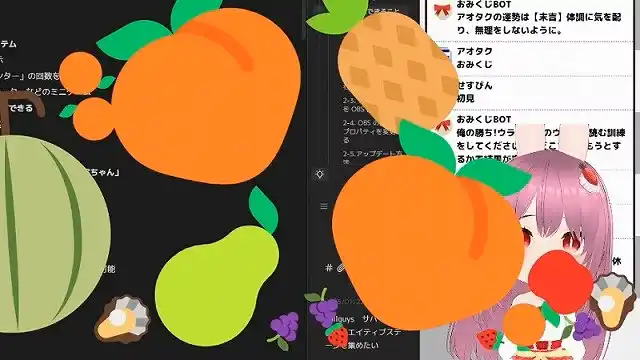

# おみくじ BOT 演出用 WordParty2.0

最終更新日：<% tp.date.now('YYYY/MM/DD') %>

![[/sharedTemplate/intro/intro_11]] WordParty テンプレート です。

- このテンプレートは、下記の「おみくじ BOT」シリーズのパッケージでのみ使用可能です。
- それぞれ、最新版で使用できます。バージョンが古い場合、正常に機能しない可能性があります。

![[/packages/OmikujiBot/template/_common/OmikujiBotPackageBOOTH]]

![[/sharedTemplate/intro/intro_22_IntroOneComme]]

## このテンプレートは何？（Features）

### おみくじ BOT を賑やかに演出する WordParty セット

- 【おみくじ BOT 用 WordParty】は、わんコメの機能 「[WordParty](https://onecomme.com/docs/feature/wordparty)」のセットです。
- このセットを導入することで、配信がより華やかで視覚的に楽しいものになります。
	- キャラクターのセリフに、効果音やアニメーションが追加で表示されるように。
	- おみくじの結果やじゃんけんの勝敗が、視覚的にわかりやすく表示されます。

## インストール方法 (Installation)

- WordPatry のテンプレートは、他のジェネレーターと同様の導入が可能です。
- 音声を OBS に乗せる場合、追加の設定が必要です。詳細は、わんコメ公式 [音声を配信にのせる方法](https://onecomme.com/docs/feature/wordparty#%E9%9F%B3%E5%A3%B0%E3%82%92%E9%85%8D%E4%BF%A1%E3%81%AB%E3%81%AE%E3%81%9B%E3%82%8B%E6%96%B9%E6%B3%95) をご覧ください。

## つかいかた・カスタマイズ (Usage/Customization)

- 使い方は、既存の WordParty と同じです。[コメントによる演出 - WordParty](https://onecomme.com/docs/feature/wordparty) をご覧ください。
- 再配布にならないよう、**わんコメの WordParty のエディターでの編集ができない**ようになっています。

## よくある質問 (FAQ)

WordParty に関する内容は、[コメントによる演出 - WordParty](https://onecomme.com/docs/feature/wordparty) をご参照ください。

### 設定関連

#### Q. 「初見さん参戦」は おみくじ BOT 以外で使ってもいい?

- 一部の動画・音声・画像は、 [CC0 1.0](https://creativecommons.org/publicdomain/zero/1.0/) で公開しており、クレジット不要で使用できます。
- 素材に関するクレジットは [おみくじBOT用WordParty クレジット・ライセンス](sub/OmikenWordPartyCredits.md) をご覧ください。

## トラブルシューティング (Troubleshooting)

### WordPatry エディタで開けない

A: [仕様](https://onecomme.com/docs/feature/wordparty#%E3%81%9D%E3%81%AE%E4%BB%96%E4%BB%95%E6%A7%98) です。WordPatry エディタの仕様上、素材の再配布になる恐れがあるため、エディターでひらけないようになっています。

## クレジット・ライセンス（Credits/License）

- [おみくじBOT用WordParty クレジット・ライセンス](sub/OmikenWordPartyCredits.md) にまとめています。
- このアプリに収録されている効果音データは、クリエイティブ・コモンズではないものも含まれております。それらは別途利用規約があるものか、本アプリ専用に制作された画像・動画です。他の用途での使用・転載・再配布は禁止します。

## バージョン情報 (Version)

### v1.4.0 25/11/20

- 今後のバージョン情報の詳細は、下記に記載するようにしました。
	- <https://github.com/Pintocuru/OmikujiBot-Docs/releases>
- 素材の再配布ガイドライン上の違反（またはその懸念）があったため、新しく作り直しました。
	- そのため、v1.3 以前のおみくじ BOT シリーズとは互換性がありません。

### v1.4.0-beta5 25/11/03

- [効果音ラボ](https://soundeffect-lab.info/) での利用規約の問題に触れている可能性があったため、ファイルを大きく変更しています。(前バージョンの配布は停止しています)
	- 特に、おみくじ BOT のアプリと組み合わせるケースで問題があった（効果音を任意に選んで鳴らせるような仕組みがあった）ためです。
	- そのため、過去の「おみくじ BOT」のデータとは互換性がありません。
	- また、再配布にならないよう、わんコメの WordParty エディターで編集できないようになっています。
- また、これにより、フキダシ表示時の効果音は、この WordParty からではなく、ジェネレーター本体から鳴らすように変更しています。
- クリエイティブ・コモンズの素材を使用するようになったため、クレジット・ライセンス の表記を細かく記載するようにしました。

### v1.2.0-beta3 25/09/18

- [効果音ラボ](https://soundeffect-lab.info/) から新しい効果音素材を 2 種類追加。
- 「タロットカード」と「超おみくじ」用に新しい素材を追加。

### v1.1.0 25/09/09

- 「おみくじ BOT」「おみくじ BOT コンフィグエディター」と揃えるため、バージョニングを揃えることにしました。
- 過去のリリースノートは [こちら](https://github.com/Pintocuru/OmikujiBot-Docs/releases/tag/v1.0.0-OmikujiBotWordParty)

<%* await tp.user.expandEmbeds(tp) %>
