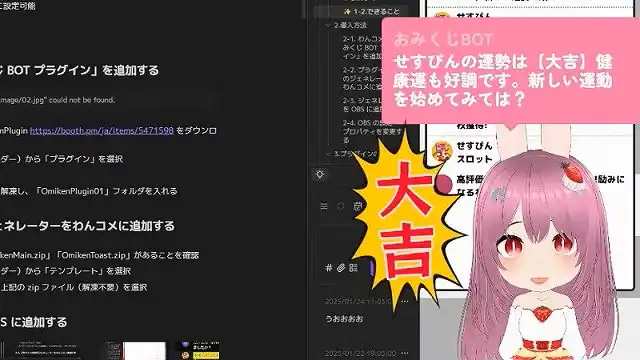
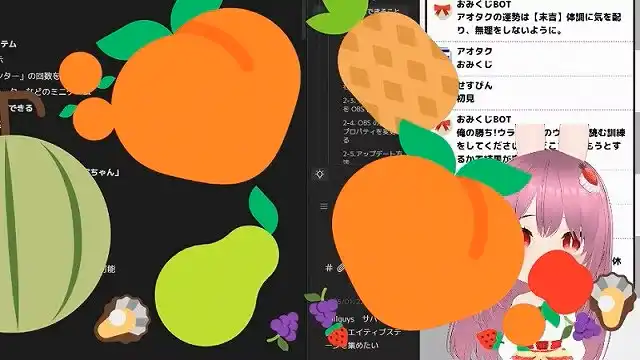
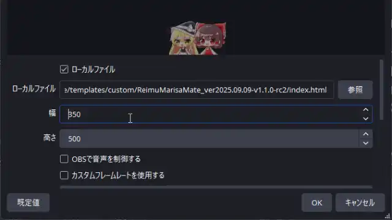

# おみくじ BOT OmikujiBot

最終更新日：2026/02/24

配信者のためのコメントアプリ「わんコメ」で使用できる、 BOT ソフトウェア です。

このテンプレートは、下記のパッケージの内容を含みます。

- [おみくじBOT ストロベリーショコラ OmikujiBot StrawberryChocolate](https://pintocuru.booth.pm/items/7733810)
- [おみくじ BOT ゆっくり霊夢&魔理沙 OmikujiBot ReimuMarisa](https://pintocuru.booth.pm/items/5471598)
- [おみくじ BOT みんなのずんだもん OmikujiBot EveryoneZunda](https://pintocuru.booth.pm/items/6053855)
- [おみくじ BOT 高飛車な四国めたん OmikujiBot DivaMetan](https://pintocuru.booth.pm/items/6058829)
- [おみくじ BOT じゃんけん OmikujiBot HondaJanken](https://pintocuru.booth.pm/items/7383088)
- [おみくじ BOT カード駅 OmikujiBot CardStation](https://pintocuru.booth.pm/items/7412886)
- [おみくじ BOT タロットカード OmikujiBot TarotCard](https://pintocuru.booth.pm/items/7432682)
- [おみくじ BOT 超おみくじ OmikujiBot BigBangFortune](https://pintocuru.booth.pm/items/7440428)
- [おみくじ BOT スイカジェネレーター +カボチャ&クジラ OmikujiBot GouseiSuika](https://pintocuru.booth.pm/items/5813323)
- [おみくじ BOT ボンバースロット OmikujiBot BomberSpin](https://pintocuru.booth.pm/items/7730686)
- [どこでもドラちゃん Bot OmikujiBot 5percent_Dora](https://pintocuru.booth.pm/items/7291931)

## はじめに（Intro）

- [わんコメ](https://onecomme.com/) の機能を前提としたソフトウェアです。
- 本ソフトウェアの利用は自己責任でお願いいたします。
- 仕様は予告なく変更される場合があります。

## このテンプレートは何？（Features）

### 🎯 わんコメに BOT 機能を付与するジェネレーター

- 【おみくじ BOT OmikujiBot】は、わんコメに BOT 機能を付与するジェネレーターです。
- 特定のワード (おみくじ 等) と、チャットに投稿することで、ランダムな結果を配信画面に表示します。
- 初見さん (初めてのコメント) や、通算 100 回目のコメントなど、特定の条件で発動し、配信画面に表示することも可能です。

### ✨【おみくじ BOT OmikujiBot】で、できること

1. **コメントに反応する【おみくじシステム】**
   - `おみくじ` とコメントすると、今日の運勢をランダムで表示
   - `じゃんけん` のような複雑なおみくじ結果も表示できる
   - `スイカジェネレーター` などのミニゲームで楽しむ
2. **[【コンフィグエディター】](https://github.com/Pintocuru/OmikujiBot-Docs/blob/main/core/ConfigEditor/README.md) で多彩なおみくじを自作できる**
   - おみくじの内容は、自由に編集可能
   - フキダシの大きさ・色替え・アニメーションも自由に変更可能
   - わんコメの機能「WordParty」を使い、自由に演出を表示可能
3. **【初見判定ちゃん機能】で、初見さんや常連さんを判別**
   - 初めての視聴者を判別し、個別に挨拶してくれます
   - 1 週間以上の間隔が空くと、挨拶のコメントも変化します
   - 「初見詐欺」を見破る機能も搭載
4. **ギフト・メンバー限定への機能制限も可能**
   - すべてのおみくじ・ミニゲームは、ギフト限定等条件を絞ることが可能
   - メンバー、サブスク限定のおみくじの設定が可能
   - 金額に応じて、メッセージも変えられます
5. **【タイマー機能】でチャンネル登録を促す**
   - 現在の視聴数、高評価数の表示をトーストで表示できます
   - SNS やファンクラブの告知も自動投稿
   - 投稿間隔も設定可能で、時報代わりにも使えます

## インストール (Installation)

> それぞれのパッケージに記載されている「インストール方法」をご覧ください。

### OBS でジェネレーターを表示させる際の「幅」について

- 表示サイズは柔軟に調整可能で、コンパクトにもワイドにも対応できます。
- 幅の最大値は `2xl = 42rem`（672px）、最小値は `10rem`（160px）です。
  - それ以下にすると、はみ出しなどの表示崩れが起こる可能性があります。

### おみくじ BOT のアップグレード / コンフィグエディターの新規導入

> 現在のバージョンは **コンフィグエディター** から確認できます。
> パッケージに「コンフィグエディター」が含まれていない場合でも、**このアップグレード手順を実行すれば新規導入として利用できます。**

#### アップグレード手順

1. Github から [最新バージョン](https://github.com/Pintocuru/OmikujiBot-Docs/releases/latest) をダウンロードします。
2. リリースノート下部の **「Assets」** から、 **「OmikujiBot_core_」** と書かれたファイルをダウンロードします。
3. ダウンロードした ZIP ファイルを **解凍** します。

1. **わんコメを起動** します。
2. 「テンプレート」画面で、アップグレードしたいテンプレートを選び、右側の **「フォルダを開く」** をクリックします。
3. 解凍したファイルを、開いたフォルダへ **上書き保存** します。
4. 念のため、**コンフィグエディターを起動し、バージョンが最新になっているか** を確認してください。

- **注意**：アップグレード後、一部設定がデフォルトに戻る場合があります。バックアップは必ず行って下さい。

## PRO 版へのアップグレード (Installation)

### PRO(有料) 版でできること

- PRO 版は以下の機能が追加されます
	- コンフィグエディターの「テンプレートの読み込み・出力」が可能になります。
	- フキダシのフォント設定・アニメーション設定を自在に選べるようになります。
	- プラグイン使用時「プリセット管理」機能で、複数のおみくじデータを管理できます
- PRO 版をご購入いただくと、配布ファイル内の `readme.txt` にライセンスキーが記載されています。
- コンフィグエディターの「表示設定 ＞ エディター設定」に、ライセンスキーを入力する欄がありますので、そこへコピー＆ペーストしてください。
- PRO 版へのインストールに関する方法は [PRO(有料) 版へのアップグレードの方法](https://github.com/Pintocuru/OmikujiBot-Docs/tree/main/core/OmikujiBot#pro%E6%9C%89%E6%96%99-%E7%89%88%E3%81%B8%E3%81%AE%E3%82%A2%E3%83%83%E3%83%97%E3%82%B0%E3%83%AC%E3%83%BC%E3%83%89%E3%81%AE%E6%96%B9%E6%B3%95) をご覧ください。

### PRO 版へのアップグレードの方法

ライセンスキーを使ってアップグレードできます。

1. [おみくじBOT ストロベリーショコラ OmikujiBot StrawberryChocolate](https://pintocuru.booth.pm/items/7733810) より **【PRO 版＋ライセンスキー】** を購入する
2. ダウンロードした PRO 版の zip ファイル内にある `readme.txt` を開き、ライセンスキーをコピーする
3. コンフィグエディターのアプリを開き、**表示設定 ＞ エディター設定** を開く
4. 「ライセンスキー」欄にコピーしたキーを貼り付ける
5. 「設定を出力」ボタンをクリックして、既存の js ファイルを上書きする

このアップグレードを行う場合、PRO 版に入っているデータは「テンプレート読み込み (JSON)」から読み込んでください。

### 過去に上記以外の方法で PRO 版をご購入いただいた方

ライセンスキーはそのまま有効です。今後も PRO 版としてご利用いただけます。アップデートは無償で提供されますので安心してお使いください。

## つかいかた (Usage)

> パッケージによって、利用シーンは様々です。詳しくは、下記の Readme をご覧ください。

- [おみくじ BOT ストロベリーショコラ OmikujiBot StrawberryChocolate README](https://github.com/Pintocuru/OmikujiBot-Docs/blob/main/full/StrawberryChocolate/README.md)
- [おみくじ BOT ゆっくり霊夢&魔理沙 OmikujiBot ReimuMarisa README](https://github.com/Pintocuru/OmikujiBot-Docs/blob/main/full/ReimuMarisa/README.md)
- [おみくじ BOT みんなのずんだもん OmikujiBot Everyone Zunda README](https://github.com/Pintocuru/OmikujiBot-Docs/blob/main/full/EveryoneZunda/README.md)
- [おみくじ BOT 高飛車な四国めたん OmikujiBot Diva Metan README](https://github.com/Pintocuru/OmikujiBot-Docs/blob/main/full/DivaMetan/README.md)
- [おみくじ BOT じゃんけん OmikujiBot HondaJanken README](https://github.com/Pintocuru/OmikujiBot-Docs/blob/main/solo/HondaJanken/README.md)
- [おみくじ BOT カード駅 OmikujiBot CardStation README](https://github.com/Pintocuru/OmikujiBot-Docs/blob/main/solo/CardStation/README.md)
- [おみくじ BOT 超おみくじ OmikujiBot BigBangFortune README](https://github.com/Pintocuru/OmikujiBot-Docs/blob/main/solo/BigBangFortune/README.md)
- [おみくじ BOT タロットカード OmikujiBot TarotCard README](https://github.com/Pintocuru/OmikujiBot-Docs/blob/main/solo/TarotCard/README.md)
- [おみくじ BOT スイカジェネレーター + カボチャ&クジラ OmikujiBot GouseiSuika README](https://github.com/Pintocuru/OmikujiBot-Docs/blob/main/solo/GouseiSuika/README.md)
- [おみくじ BOT ボンバースロット OmikujiBot BomberSpin](https://github.com/Pintocuru/OmikujiBot-Docs/blob/main/solo/BomberSpin/README.md)
- [どこでもドラちゃん Bot OmikujiBot 5percent_Dora README](https://github.com/Pintocuru/OmikujiBot-Docs/blob/main/solo/5percent_Dora/README.md)

## カスタマイズ（Customization）

## カスタマイズ（Customization）

### 「コンフィグエディター」で自由におみくじを編集できる

- 一部の配布パッケージには、**コンフィグエディター**（おみくじデータ編集用アプリ）が付属しています。
	- 付属されていない場合、新しく導入する必要があります。[コンフィグエディターの新規導入](https://github.com/Pintocuru/OmikujiBot-Docs/blob/main/template/installation/Installation_52_VersionUp.md) をご覧ください。
- アプリと同じフォルダにある **`ConfigMaker.html`** を開くと起動できます。
- 詳しくは [おみくじ BOT コンフィグエディター README](https://github.com/Pintocuru/OmikujiBot-Docs/blob/main/core/ConfigEditor/README.md) をご覧ください。

## よくある質問 (FAQ)

> わんコメの機能については [よくある質問](https://onecomme.com/docs/faq) または [導入ガイド](https://onecomme.com/docs/guide) をご参照ください。

> おみくじの内容、エディター関連についての内容は [おみくじ BOT コンフィグエディター README](https://github.com/Pintocuru/OmikujiBot-Docs/blob/main/core/ConfigEditor/README.md) の [よくある質問](https://github.com/Pintocuru/OmikujiBot-Docs/blob/main/core/ConfigEditor/README.md#%E3%82%88%E3%81%8F%E3%81%82%E3%82%8B%E8%B3%AA%E5%95%8F-faq) をご覧ください。

- コメントテスターで「初見コメント」を確認するには

#### Q. Omiken って何？

A: おみくじ (omikuji)＋初見 (syoken) から取ってます。前作「[初見判定ちゃん](https://booth.pm/ja/items/5471598) 」の名残です。

## トラブルシューティング (Troubleshooting)

わんコメの機能については [トラブルシューティング](https://onecomme.com/docs/trouble-shooting) または [導入ガイド](https://onecomme.com/docs/guide) をご参照ください。

### 設定・表示・音声関連

- [Q. OBS 側で非表示にしていても、BOT のコメントが勝手に動いてしまう](https://github.com/Pintocuru/OmikujiBot-Docs/blob/main/template/troubleshooting/12_infoOmikujiBot/trouble_1202_OBSSound.md)
- [Q. キャラクター画像が表示されない](https://github.com/Pintocuru/OmikujiBot-Docs/blob/main/template/troubleshooting/12_infoOmikujiBot/trouble_1203_CharacterImage.md)
- [Q. WordParty の音が配信に出ない](https://github.com/Pintocuru/OmikujiBot-Docs/blob/main/template/troubleshooting/12_infoOmikujiBot/trouble_1206_infoWordParty.md)

### おみくじ関連

- [Q. コメントでおみくじが反応しない](https://github.com/Pintocuru/OmikujiBot-Docs/blob/main/template/troubleshooting/12_infoOmikujiBot/trouble_1204_CommentOmikuji.md)
- [Q. おみくじが Youtube のコメントに反映されていない](https://github.com/Pintocuru/OmikujiBot-Docs/blob/main/template/troubleshooting/12_infoOmikujiBot/trouble_1205_OmikujiPlatform.md)

## クレジット（Credits）

### ♫ 効果音・ジングル

- [効果音・ジングルに関するライセンス](sub/sounds.md) にまとめています。
	- このアプリに収録されている効果音データは、すべて [CC0 1.0](https://creativecommons.org/publicdomain/zero/1.0/) です。

それぞれのパッケージでは、各種イラスト素材を使用しています。詳しくは、下記の Readme をご覧ください。

- [おみくじ BOT ストロベリーショコラ OmikujiBot StrawberryChocolate README](https://github.com/Pintocuru/OmikujiBot-Docs/blob/main/full/StrawberryChocolate/README.md)
- [おみくじ BOT ゆっくり霊夢&魔理沙 OmikujiBot ReimuMarisa README](https://github.com/Pintocuru/OmikujiBot-Docs/blob/main/full/ReimuMarisa/README.md)
- [おみくじ BOT みんなのずんだもん OmikujiBot Everyone Zunda README](https://github.com/Pintocuru/OmikujiBot-Docs/blob/main/full/EveryoneZunda/README.md)
- [おみくじ BOT 高飛車な四国めたん OmikujiBot Diva Metan README](https://github.com/Pintocuru/OmikujiBot-Docs/blob/main/full/DivaMetan/README.md)
- [おみくじ BOT じゃんけん OmikujiBot HondaJanken README](https://github.com/Pintocuru/OmikujiBot-Docs/blob/main/solo/HondaJanken/README.md)
- [おみくじ BOT カード駅 OmikujiBot CardStation README](https://github.com/Pintocuru/OmikujiBot-Docs/blob/main/solo/CardStation/README.md)
- [おみくじ BOT 超おみくじ OmikujiBot BigBangFortune README](https://github.com/Pintocuru/OmikujiBot-Docs/blob/main/solo/BigBangFortune/README.md)
- [おみくじ BOT タロットカード OmikujiBot TarotCard README](https://github.com/Pintocuru/OmikujiBot-Docs/blob/main/solo/TarotCard/README.md)
- [おみくじ BOT スイカジェネレーター + カボチャ&クジラ OmikujiBot GouseiSuika README](https://github.com/Pintocuru/OmikujiBot-Docs/blob/main/solo/GouseiSuika/README.md)
- [おみくじ BOT ボンバースロット OmikujiBot BomberSpin](https://github.com/Pintocuru/OmikujiBot-Docs/blob/main/solo/BomberSpin/README.md)
- [どこでもドラちゃん Bot OmikujiBot 5percent_Dora README](https://github.com/Pintocuru/OmikujiBot-Docs/blob/main/solo/5percent_Dora/README.md)

## ライセンス（License）

### アプリ本体（ジェネレーター・コンフィグエディター）

- Copyright © 2023-2026 Pintocuru(せすじピンとしてます)
- 本ソフトウェア (おみくじ BOT) は、著作権者の許可なく再配布することを禁じます。
- 本ソフトウェアは、Github、または BOOTH にて提供される各パッケージに含まれる形でのみ配布されます。
- 改変・逆コンパイル・再販売も禁止されています。

### パッケージデータ

パッケージごとにライセンス形態（商用利用可否・改変可否など）が異なります。詳しくは各パッケージの README または商品ページをご確認ください。

## バージョン情報 (Version)

> 詳細な変更履歴は [Releases](https://github.com/Pintocuru/OmikujiBot-Docs/releases) をご覧ください。

---

作成者：Pintocuru(せすじピンとしてます) @pintocuru

[Twitter](https://twitter.com/pintocuru) | [YouTube](https://www.youtube.com/@pintocuru)
