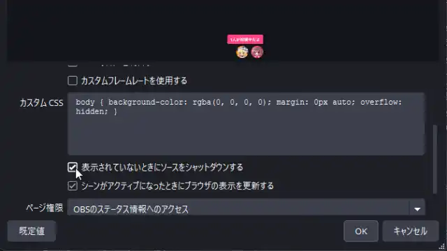

# おみくじ BOT OmikujiBot

最終更新日：2025/09/09

配信者のためのコメントアプリ「わんコメ」で使用できる、 BOT ソフトウェア です。

このテンプレートは、下記のパッケージの内容を含みます。

- [おみくじ BOT ゆっくり霊夢&魔理沙 OmikujiBot ReimuMarisa](https://pintocuru.booth.pm/items/5471598)
- [おみくじ BOT ずんだもん OmikujiBot Zundamon](https://pintocuru.booth.pm/items/6053855)
- [おみくじ BOT 高飛車な四国めたん OmikujiBot Diva Metan](https://pintocuru.booth.pm/items/6058829)
- おみくじ BOT ズッ友!つむぎ&ひまり OmikujiBot Tsumugi & Himari
- [どこでもドラちゃん Bot OmikujiBot 5percent_Dora](https://pintocuru.booth.pm/items/7291931)
- [スイカ 🍉 ジェネレーター Gousei Suika Generator](https://pintocuru.booth.pm/items/5813323)

## はじめに（Intro）

- [わんコメ](https://onecomme.com/) の機能を前提としたソフトウェアです。
- 本ソフトウェアの利用は自己責任でお願いいたします。
- 仕様は予告なく変更される場合があります。

## このテンプレートは何？（Features）

### 🎯 わんコメに BOT 機能を付与するジェネレーター

- 【おみくじ BOT OmikujiBot】は、わんコメに BOT 機能を付与するジェネレーターです。
- 特定のワード (おみくじ 等) と、チャットに投稿することで、ランダムな結果を配信画面に表示します。
- 初見さん (初めてのコメント) や、通算 100 回目のコメントなど、特定の条件で発動し、配信画面に表示する機能

### ✨【おみくじ BOT OmikujiBot】で、できること

1. **コメントに反応する【おみくじシステム】**
   - `おみくじ` とコメントすると、今日の運勢をランダムで表示
   - `じゃんけん` のような複雑なおみくじ結果も表示できる
   - スイカジェネレーターなどのミニゲームで楽しむ
2. **[【コンフィグエディター】](../OmikujiBot_ConfigEditor/README.md) で多彩なおみくじを自作できる**
   - おみくじの内容は、自由に編集可能
   - フキダシの大きさ・色替え・アニメーションも自由に変更可能
   - わんコメの機能「WordParty」を使い、自由に演出を表示可能
3. **【初見判定ちゃん機能】で、初見さんや常連さんを判別**
   - 初めての視聴者を判別し、個別に挨拶してくれます
   - 1 週間以上の間隔が空くと、挨拶のコメントも変化します
   - 「初見詐欺」を見破る機能も搭載
4. **ギフト・メンバー限定への機能制限も可能**
   - すべてのおみくじ・ミニゲームは、ギフト限定等条件を絞ることが可能
   - メンバー、サブスク限定のおみくじの設定が可能
   - 金額に応じて、メッセージも変えられます
5. **【タイマー機能】でチャンネル登録を促す**
   - 現在の視聴数、高評価数の表示をトーストで表示できます
   - SNS やファンクラブの告知も自動投稿
   - 投稿間隔も設定可能で、時報代わりにも使えます

## インストール方法 (Installation)

> それぞれのパッケージに記載されている「インストール方法」をご覧ください。

## つかいかた (Usage)

> パッケージによって、利用シーンは様々です。詳しくは、下記の Readme をご覧ください。

- [おみくじ BOT ゆっくり霊夢&魔理沙 OmikujiBot ReimuMarisa README](/docs/OmikujiBotReimuMarisa/README.md)
- [おみくじ BOT みんなのずんだもん OmikujiBot Everyone Zunda README](/docs/OmikujiBotEveryoneZunda/README.md)
- [おみくじ BOT 高飛車な四国めたん OmikujiBot Diva Metan README](/docs/OmikujiBotDivaMetan/README.md)
- [おみくじ BOT ズッ友!つむぎ&ひまり OmikujiBot Tsumugi & Himari README](/docs/OmikujiBotTsumugiHimari/README.md)
- [どこでもドラちゃん Bot OmikujiBot 5percent_Dora README](/docs/OmikujiBot5percent_Dora/README.md)
- [スイカ 🍉 ジェネレーター Gousei Suika Generator README](/docs/GouseiSuika/README.md)

## カスタマイズ（Customization）

### コンフィグエディターで自由におみくじを編集できる

すべての配布パッケージには、**コンフィグエディター**（おみくじデータ編集用アプリ）が付属しています。

アプリと同じフォルダにある **`ConfigMaker.html`** を開くと起動できます。

配布パッケージの種類によっては、一部機能が制限または非表示になっている場合があります。

詳しくは [おみくじ BOT コンフィグエディター README](/docs/OmikujiBot_ConfigEditor/README.md) をご覧ください。

## よくある質問 (FAQ)

わんコメの機能については [よくある質問](https://onecomme.com/docs/faq) または [導入ガイド](https://onecomme.com/docs/guide) をご参照ください。

### システム関連

#### Q. ギフト・スパチャされた時にだけ発動させたい

#### Q. メンバー限定で発動させたい

#### Q. 1 日 1 回と、回数を制限したい

A: [おみくじ BOT コンフィグエディター](../OmikujiBot_ConfigEditor/README.md) で設定が可能です。

### フキダシ・キャラクター表示関連

> キャラクターに関する扱いについては、各パッケージごとに異なります。

#### Q. フキダシの色を変更したい

#### Q. キャラクターを消してフキダシだけにしたい

#### Q. 右下のアイコンを消したい

#### Q. 文字やキャラクターを大きく・小さく表示したい

#### Q. 自前のキャラクター画像を追加したい

A: [おみくじ BOT コンフィグエディター](../OmikujiBot_ConfigEditor/README.md) で設定が可能です。

### おみくじ関連

#### Q. おみくじの内容を変更したい

#### Q. おみくじが出てくる確率を変更したい

#### Q. おみくじをメンバー限定にしたい

A: [おみくじ BOT コンフィグエディター](../OmikujiBot_ConfigEditor/README.md) で設定が可能です。

#### Q. じゃんけんの勝率低すぎない？

A: これでも高い方です (勝率は約 5%)。[ケイスケ ホンダ](https://dic.pixiv.net/a/%E6%9C%AC%E7%94%B0%E3%81%A8%E3%81%98%E3%82%83%E3%82%93%E3%81%91%E3%82%93) はもっと強いです。

#### Q. Omiken って何？

A: おみくじ (omikuji)＋初見 (syoken) から取ってます。前作「初見判定ちゃん<https://booth.pm/ja/items/5471598> の名残です。」

## トラブルシューティング (Troubleshooting)

> わんコメの機能については [トラブルシューティング](https://onecomme.com/docs/trouble-shooting) または [導入ガイド](https://onecomme.com/docs/guide) をご参照ください。

### 設定・表示・音声関連

#### Q. 棒読みちゃんの音が鳴らない

A: わんコメ公式の [読み上げ設定](https://onecomme.com/docs/settings/speech) をご覧ください。

#### Q. OBS 側で非表示にしていても、BOT のコメントが勝手に動いてしまう

A: OBS のソース＞該当する html ファイル＞プロパティ から、**「表示されていないときにソースをシャットダウンする」のチェックは外して下さい。** （デフォルトでは OFF になっています）

#### Q. キャラクター画像が表示されない

**A:** キャラクター画像は、配布パッケージの `Characters` フォルダに格納されています。各キャラクターごとにサブフォルダがあり、その中に画像が入っています。何らかの理由で画像ファイルが存在しない場合は、インストールをやり直してください。

### おみくじ関連

#### Q. コメントでおみくじが反応しない

A: わんコメでコメントが受信できていないと、おみくじも反応しません。詳しくは、わんコメ公式 [Q.コメントがうまく表示されない](https://onecomme.com/docs/faq#%E3%82%B3%E3%83%A1%E3%83%B3%E3%83%88%E9%96%A2%E9%80%A3) をご覧ください。

#### Q. おみくじが Youtube のコメントに反映されていない

A: おみくじをはじめとする BOT のコメントは、わんコメを通じてジェネレーターでのみ表示されます。YouTube や Twitch のチャットには投稿・反映されません。

#### Q. どうしても、BOT コメントを Youtube のチャットに表示させたい

A: Youtube・Twitch 限定で [SAMMI](https://sammi.solutions/) を使ってコメントを投稿する方法もありますが、素直に [Nightbot](https://nightbot.tv/) や、 [CastCraft](https://castcraft.live/) を使うほうが簡単かも。

#### Q. おみくじを連続で行うとコメントが反映されなくなる

A: おみくじを短時間に何度も行うと、配信プラットフォームの自動規制（ソフト BAN）により、コメントが反映されなくなることがあります。**テストの場合は、わんコメの コメントテスター をお使いください。**

## クレジット（Credits）

それぞれのパッケージでは、各種イラスト素材を使用しています。詳しくは、下記の Readme をご覧ください。

- [おみくじ BOT ゆっくり霊夢&魔理沙 OmikujiBot ReimuMarisa README](/docs/OmikujiBotReimuMarisa/README.md)
- [おみくじ BOT みんなのずんだもん OmikujiBot Everyone Zunda README](/docs/OmikujiBotEveryoneZunda/README.md)
- [おみくじ BOT 高飛車な四国めたん OmikujiBot Diva Metan README](/docs/OmikujiBotDivaMetan/README.md)
- [おみくじ BOT ズッ友!つむぎ&ひまり OmikujiBot Tsumugi & Himari README](/docs/OmikujiBotTsumugiHimari/README.md)
- [どこでもドラちゃん Bot OmikujiBot 5percent_Dora README](/docs/OmikujiBot5percent_Dora/README.md)
- [スイカ 🍉 ジェネレーター Gousei Suika Generator README](/docs/GouseiSuika/README.md)

## ライセンス（License）

### アプリ本体（ジェネレーター・コンフィグエディター）

- Copyright © 2025 Pintocuru(せすじピンとしてます)
- 本ソフトウェア (おみくじ BOT) は、著作権者の許可なく再配布することを禁じます。
- 本ソフトウェアは、BOOTH にて提供される各パッケージに含まれる形でのみ配布されます。
- 改変・逆コンパイル・再販売も禁止されています。

### パッケージデータ

パッケージごとにライセンス形態（商用利用可否・改変可否など）が異なります。詳しくは各パッケージの README または商品ページをご確認ください。

## バージョン情報 (Version)

> 詳細な変更履歴は [Releases](https://github.com/Pintocuru/OmikujiBot-Docs/releases) をご覧ください。

### v1.1.0 25/09/09-rc1

- フキダシの「かぎ」を編集可能にしました。
	- かぎは、TailwindCSS の class で実現しています。
- トースト表示にキャラクターアイコンを付けられるようになりました。
	- トーストにも「カギ」が付くようになりました。
- トースト・サムネイルの表示を右下か、左下かを選べるようになりました。
- 「キャラクター統合モード」の新設。
- アイコン非表示時「BOT コメントをわんコメに投稿」するとコメントが読まれなかったバグを修正

---

作成者：せすじピンとしてます @pintocuru

[Twitter](https://twitter.com/pintocuru) | [YouTube](https://www.youtube.com/@pintocuru)