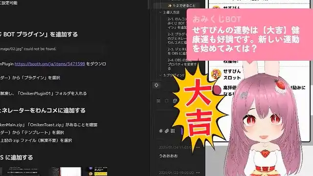
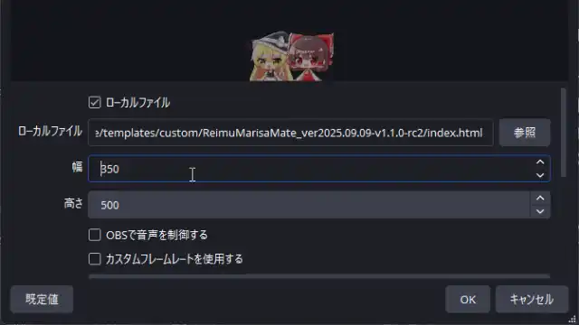
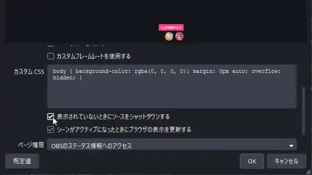

# おみくじ BOT OmikujiBot

最終更新日：<% tp.date.now('YYYY/MM/DD') %>

 BOT ソフトウェア です。

このテンプレートは、下記のパッケージの内容を含みます。

## このテンプレートは何？（Features）

### 🎯 わんコメに BOT 機能を付与するジェネレーター

- 【おみくじ BOT OmikujiBot】は、わんコメに BOT 機能を付与するジェネレーターです。
- 特定のワード (おみくじ 等) と、チャットに投稿することで、ランダムな結果を配信画面に表示します。
- 初見さん (初めてのコメント) や、通算 100 回目のコメントなど、特定の条件で発動し、配信画面に表示する機能

### ✨【おみくじ BOT OmikujiBot】で、できること

1. **コメントに反応する【おみくじシステム】**
   - `おみくじ` とコメントすると、今日の運勢をランダムで表示
   - `じゃんけん` のような複雑なおみくじ結果も表示できる
   - スイカジェネレーターなどのミニゲームで楽しむ
2. **[【コンフィグエディター】](https://github.com/Pintocuru/OmikujiBot-Docs/blob/main/core/ConfigEditor/README.md) で多彩なおみくじを自作できる**
   - おみくじの内容は、自由に編集可能
   - フキダシの大きさ・色替え・アニメーションも自由に変更可能
   - わんコメの機能「WordParty」を使い、自由に演出を表示可能
3. **【初見判定ちゃん機能】で、初見さんや常連さんを判別**
   - 初めての視聴者を判別し、個別に挨拶してくれます
   - 1 週間以上の間隔が空くと、挨拶のコメントも変化します
   - 「初見詐欺」を見破る機能も搭載
4. **ギフト・メンバー限定への機能制限も可能**
   - すべてのおみくじ・ミニゲームは、ギフト限定等条件を絞ることが可能
   - メンバー、サブスク限定のおみくじの設定が可能
   - 金額に応じて、メッセージも変えられます
5. **【タイマー機能】でチャンネル登録を促す**
   - 現在の視聴数、高評価数の表示をトーストで表示できます
   - SNS やファンクラブの告知も自動投稿
   - 投稿間隔も設定可能で、時報代わりにも使えます

## インストール (Installation)

> それぞれのパッケージに記載されている「インストール方法」をご覧ください。

### OBS でジェネレーターを表示させる際の「幅」について

- 表示サイズは柔軟に調整可能で、コンパクトにもワイドにも対応できます。
- 幅の最大値は `2xl = 42rem`（672px）、最小値は `10rem`（160px）です。
  - それ以下にすると、はみ出しなどの表示崩れが起こる可能性があります。

![[Installation_51_ProUpgradeTemplate]]

## つかいかた (Usage)

> パッケージによって、利用シーンは様々です。詳しくは、下記の Readme をご覧ください。

## カスタマイズ（Customization）

### フキダシ・キャラクター表示関連

> キャラクターに関する扱いについては、各パッケージごとに異なります。

#### Q. フキダシの色を変更したい

#### Q. キャラクターを消してフキダシだけにしたい

#### Q. 右下のアイコンを消したい

#### Q. 文字やキャラクターを大きく・小さく表示したい

#### Q. 自前のキャラクター画像を追加したい

A: [おみくじ BOT コンフィグエディター](https://github.com/Pintocuru/OmikujiBot-Docs/blob/main/core/ConfigEditor/README.md) で設定が可能です。

### おみくじ関連

#### Q. おみくじの内容を変更したい

#### Q. おみくじが出てくる確率を変更したい

#### Q. おみくじをメンバー限定にしたい

A: [おみくじ BOT コンフィグエディター](https://github.com/Pintocuru/OmikujiBot-Docs/blob/main/core/ConfigEditor/README.md) で設定が可能です。

#### Q. Omiken って何？

A: おみくじ (omikuji)＋初見 (syoken) から取ってます。前作「[初見判定ちゃん](https://booth.pm/ja/items/5471598) 」の名残です。

## トラブルシューティング (Troubleshooting)

### 設定・表示・音声関連

#### Q. 棒読みちゃんの音が鳴らない

A: わんコメ公式の [読み上げ設定](https://onecomme.com/docs/settings/speech) をご覧ください。

#### Q. OBS 側で非表示にしていても、BOT のコメントが勝手に動いてしまう

A: OBS のソース＞該当する html ファイル＞プロパティ から、**「表示されていないときにソースをシャットダウンする」のチェックは外して下さい。** （デフォルトでは OFF になっています）

#### Q. キャラクター画像が表示されない

**A:** キャラクター画像は、配布パッケージの `Characters` フォルダに格納されています。各キャラクターごとにサブフォルダがあり、その中に画像が入っています。何らかの理由で画像ファイルが存在しない場合は、インストールをやり直してください。

### おみくじ関連

#### Q. コメントでおみくじが反応しない

A: わんコメでコメントが受信できていないと、おみくじも反応しません。詳しくは、わんコメ公式 [Q.コメントがうまく表示されない](https://onecomme.com/docs/faq#%E3%82%B3%E3%83%A1%E3%83%B3%E3%83%88%E9%96%A2%E9%80%A3) をご覧ください。

#### Q. おみくじが Youtube のコメントに反映されていない

A: おみくじをはじめとする BOT のコメントは、わんコメを通じてジェネレーターでのみ表示されます。YouTube や Twitch のチャットには投稿・反映されません。

#### Q. どうしても、BOT コメントを Youtube のチャットに表示させたい

A: Youtube・Twitch 限定で [SAMMI](https://sammi.solutions/) を使ってコメントを投稿する方法もありますが、素直に [Nightbot](https://nightbot.tv/) や、 [CastCraft](https://castcraft.live/) を使うほうが簡単かも。

#### Q. おみくじを連続で行うとコメントが反映されなくなる

A: おみくじを短時間に何度も行うと、配信プラットフォームの自動規制（ソフト BAN）により、コメントが反映されなくなることがあります。**テストの場合は、わんコメの コメントテスター をお使いください。**

## クレジット（Credits）

### 🎵 効果音・BGM

#### **さまざまな効果音**

効果音ラボ <https://soundeffect-lab.info/>

それぞれのパッケージでは、各種イラスト素材を使用しています。詳しくは、下記の Readme をご覧ください。

## バージョン情報 (Version)

> 詳細な変更履歴は [Releases](https://github.com/Pintocuru/OmikujiBot-Docs/releases) をご覧ください。

<%* await tp.user.expandEmbeds(tp) %>
