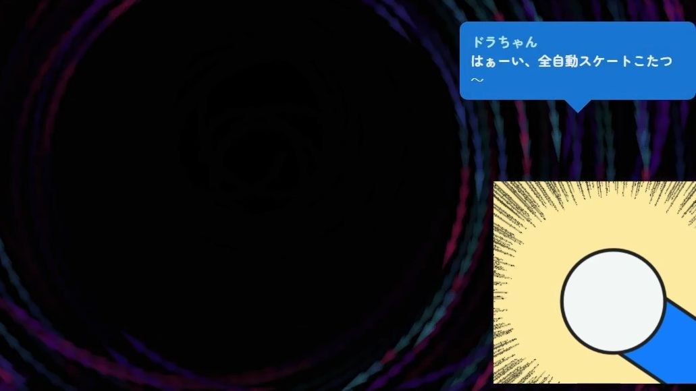

# どこでもドラちゃん Bot OmikujiBot 5percent_Dora

最終更新日：<% tp.date.now('YYYY/MM/DD') %>

 テンプレートです。

 [どこでもドラちゃん Bot OmikujiBot 5percent_Dora](https://pintocuru.booth.pm/items/7291931) の readme となります。

## このテンプレートは何？（Features）

### 「ドラちゃん」を名乗るキャラクターが「ひみつ道具」をランダムに出してくれるジェネレーター

- わんコメに BOT 機能を付与するジェネレーター【おみくじ BOT】を使った、コメントや 3 分ごとに自動でつぶやいてくれる、テンプレートです。
  

## つかいかた (Usage)

古くから商売繁盛のシンボル「信楽たぬき」「仙台四郎」にあやかり、**現代の運試し＝ソーシャルゲームのガチャにおける縁起物**として人気の「ドラちゃん」を、あなたの手元でいつでも呼び出せるようにしました。

(上記の説明は実際とは異なります。[某有名 Bot](https://x.com/5percent_dora) を模したおみくじ BOT となります。非公式パロディです。)

- **雑談配信**
  - コメントで反応するので、配信が賑やかになります。
  - 「誰がボロンさせたか」も表示してくれます。
- **ゲーム配信**
  - ガチャ要素のあるソーシャルゲームで使えるかもしれません。
  - 3 分に 1 回出現するので「5%」を引いたときにガチャを引くと、いいかもしれません。

### ドラちゃん

- 「ドラちゃん」と呼ぶと、ひみつ道具をランダムで 1 つ出してくれます。
  - 「ボロン」した時は、ボロンさせたユーザー名が表示されます
- 3 分ごとに自動で出してくれますが、配信に支障が出る時は、止めておくと良いです。

## カスタマイズ（Customization）

### その他

#### Q.ドラえもんでしょ？

A: 違います。

## ライセンス（License）

### パッケージデータ (5percent_Dora)

- ネタパッケージです。非営利の範囲であれば、配信での使用・改変は自由です。
- YouTube や Twitch 等での収益化配信も、個人による非営利利用とみなします。
  - ただし、法人・企業による利用や、パッケージの再配布・販売はご遠慮ください。
- 改変の有無にかかわらず、データ含め再配布は禁止とさせていただきます。

## バージョン情報 (Version)

### ver.250901

- おみくじ BOT のバージョン: v1.0.0

### ver.250830

- おみくじ BOT のバージョン: v0.8.0 Beta.10

### ver.250816

- 「[おみくじ BOT](../OmikujiBot/README.md)」を利用して、ガチャ配信向け BOT として新規公開しました

<%\* await tp.user.expandEmbeds(tp) %>
