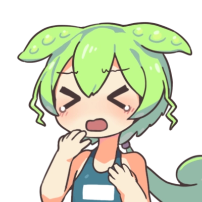

# おみくじ BOT みんなのずんだもん OmikujiBot EveryoneZunda

最終更新日：2025/08/30

配信者のためのコメントアプリ「わんコメ」で使用できる、 テンプレートです。

この内容は、BOOTH で配布している、 [おみくじ BOT みんなのずんだもん OmikujiBot EveryoneZunda](https://pintocuru.booth.pm/items/6053855) の readme となります。

## はじめに（Intro）

- [わんコメ](https://onecomme.com/) の機能を前提としたソフトウェアです。
- 本ソフトウェアの利用は自己責任でお願いいたします。
- 仕様は予告なく変更される場合があります。

## このテンプレートは何？（Features）

### ずんだもんがリスナーを歓迎してくれるジェネレーター

- わんコメに BOT 機能を付与するジェネレーター【おみくじ BOT】を使った、ずんだもんが懸命に頑張るテンプレートです。
- イラストは 坂本アヒル さんのを使用してます。
- インストールやカスタマイズ等、機能に関する内容は [おみくじ BOT OmikujiBot for わんコメ README](../OmikujiBot/README.md) をご覧ください。

### ずんだもん のキャラクター設定

このジェネレーターでは、ずんだもんを以下のようなキャラクターとして登場させています。

- 誰に対しても素直に喜び、ちょっとまごつきながらも、歓迎してくれる
  - 他人は呼び捨て、オマエ呼ばわりと、ちょっと失礼な場面も。
- 初見詐欺に対しては、妙に煽り気味で上から目線（のように見える）
- 何故か芸人ネタを持ち込む。[世界的な大スター](https://ja.wikipedia.org/wiki/%E3%81%A8%E3%81%AB%E3%81%8B%E3%81%8F%E6%98%8E%E3%82%8B%E3%81%84%E5%AE%89%E6%9D%91) が好きなようだ。

### キャラクターの立ち位置・セリフについて

- 原作とは異なる「二次創作」キャラクターのため、一般的に知られているようなキャラクター像とは異なる言動やセリフが見られる場合があります。

- 原作では「プライドの高い不幸キャラ」なのですが、おみくじ BOT のずんだもんは他人への思いやりが強かったり、不幸さが薄いかもしれません。ずんだもち 1 個贈呈なのだ。

## インストール方法 (Installation)

テンプレートのインストールは、[テンプレートの導入方法](/docs/TemplateInstall/README.md) をご覧ください。

### PRO(有料)版へのアップグレードの方法

通常版を上書きすることで、アップグレードを行います。ダウンロードページから、通常版と PRO 版の両方をダウンロードし、通常版は上記に従いインストールを行ってください。

1. ダウンロードした PRO 版の zip ファイルを解凍する
2. わんコメを起動し、右上の…ボタン　＞　テンプレートを選択
3. カスタムタブから、インストールしたテンプレートを探し、「フォルダを開く」ボタンをクリック
4. 開いたフォルダに、解凍したファイルをすべて投げ込み、上書きする

### ライセンスキーでアップグレードする方法

既存のデータがあり、ファイルの上書きが難しい場合は、ライセンスキーを使ってアップグレードできます。

1. コンフィグエディターのアプリを開き、表示設定＞エディター設定を開く
2. PRO 版の zip ファイルの中にある「readme.txt」を開き、ライセンスキーをコピーする
3. コンフィグエディターの「ライセンスキー」欄にコピーした内容を貼り付ける
4. 「設定を出力」ボタンをクリックして、既存の js ファイルを上書きする

このアップグレードを行う場合、PRO 版に入っているデータは「テンプレート読み込み(JSON)」から読み込んでください。

### 【推奨】おみくじ BOT 用 WordParty の導入について

この【おみくじ BOT OmikujiBot】は、[おみくじ BOT 用 WordParty](https://booth.pm/ja/items/6048048) の演出を前提として作られています。この WordParty を導入することで、配信がより華やかで視覚的に楽しいものになります。

- キャラクターのセリフに、効果音やアニメーションが追加で表示されるように。
- おみくじの結果やじゃんけんの勝敗が、視覚的にわかりやすく表示されます。

詳しくは [おみくじ BOT 用 WordParty README](/docs/OmikujiBot/README.md) をご覧ください。

## つかいかた (Usage)

解説動画や配信の読み上げでも良く使われる、「ずんだもん」を BOT キャラクターにしました。元気に明るく、リスナーを迎えてくれます。ちょっと生意気なのも、可愛いポイント。

- **朝活配信**
  - 今日 1 日の運勢を占う「おみくじ」で、配信が賑やかに。
- **雑談配信**
  - リスナーのコメントに対してキャラクターがボケたりツッコミを入れたりして、自然に会話が広がります。
- **ゲーム配信**
  - ゲームに集中していても、BOT が代わりに挨拶してくれるので、初見さんを見逃しません。

## カスタマイズ（Customization）

### コンフィグエディターで自由におみくじを編集できる!

すべての配布パッケージには、**コンフィグエディター**（おみくじデータ編集用アプリ）が付属しています。

アプリと同じフォルダにある **`ConfigMaker.html`** を開くと起動できます。

配布パッケージの種類によっては、一部機能が制限または非表示になっている場合があります。

詳しくは [おみくじ BOT コンフィグエディター README](/docs/OmikujiBot_ConfigEditor/README.md) をご覧ください。

- おみくじの内容は、あなたの配信に合わせて**内容を自由にカスタマイズ**できます。
- ただし、使用している**キャラクターには著作権があります**ので、原作やイラスト制作者の方々へのご配慮をお願いします。

## よくある質問 (FAQ)

わんコメの機能については [よくある質問](https://onecomme.com/docs/faq) または [導入ガイド](https://onecomme.com/docs/guide) をご参照ください。

### システム関連

#### Q. ギフト・スパチャされた時にだけ発動させたい

#### Q. メンバー限定で発動させたい

#### Q. 1 日 1 回と、回数を制限したい

A: [おみくじ BOT コンフィグエディター](../OmikujiBot_ConfigEditor/README.md) で設定が可能です。

## トラブルシューティング (Troubleshooting)

わんコメの機能については [トラブルシューティング](https://onecomme.com/docs/trouble-shooting) または [導入ガイド](https://onecomme.com/docs/guide) をご参照ください。

#### Q. 棒読みちゃんの音が鳴らない

#### Q. OBS 側で非表示にしていても、BOT のコメントが勝手に動いてしまう

#### Q. コメントでおみくじが反応しない

#### Q. おみくじが Youtube のコメントに反映されていない

#### Q. おみくじを連続で行うとコメントが反映されなくなる

A. [おみくじ BOT README トラブルシューティング](../OmikujiBot/README.md) をお読みください。

#### Q. WordParty の音が配信に出ない

わんコメ公式 [テンプレートの導入方法](../TemplateInstall/README.md) をご覧ください

## クレジット（Credits）

- **ずんだもん ずんだもん立ち絵素材 - 坂本アヒルのイラスト - pixiv**[https://www.pixiv.net/artworks/92641351](https://www.pixiv.net/artworks/92641351)

### 素材の取り扱いについて

- イラスト素材・動画・音源の再配布は禁止です。

オマエ！どうしてこんな格好をさせるのだ！ひどい仕打ちなのだ！

## ライセンス（License）

### パッケージデータ (通常版)

- 【CC-BY 4.0】 このパッケージのデータ (Json データ) は、 [Creative Commons Attribution 4.0 International (CC-BY 4.0)](https://creativecommons.org/licenses/by/4.0/) に基づいて提供されます。
- クレジット表記をすれば、改変・再利用が可能です。
- パッケージに含まれるイラスト画像等は、CC-BY 4.0 の対象外です。

### パッケージデータ PRO(有料版)

- 非営利の範囲であれば、配信での使用・改変は自由です。
- YouTube や Twitch 等での収益化配信も、個人による非営利利用とみなします。
- 改変の有無にかかわらず、再配布は禁止とさせていただきます。
- 商用利用については、お問い合わせ下さい。
  - ※ 本パッケージには画像素材は含まれておりません。そのため、素材規約には該当しません。

### アプリ本体（ジェネレーター・コンフィグエディター）

- Copyright © 2025 Pintocuru(せすじピンとしてます)
- 本ソフトウェア (おみくじ BOT) は、著作権者の許可なく再配布することを禁じます。
- 本ソフトウェアは、BOOTH にて提供される各パッケージに含まれる形でのみ配布されます。
- 改変・逆コンパイル・再販売も禁止されています。

## バージョン情報 (Version)

### ver.250828

- おみくじ BOT のバージョン: v0.8.0 Beta.09
- 「[おみくじ BOT](../OmikujiBot/README.md)」のバージョンアップに伴い、内容をリニューアルしました。
  - じゃんけんでは「僕」と言い換えています。
  - 公式に合わせ、ユーザーへの呼び方を「さん」付けから、呼び捨てにしました。
  - ユーザーに対して「オマエ」と呼ぶパターンを増やしました。
    - このアップデートにより、少しだけ、幸が薄くなりました。

### ver.240830

- 「初見判定ちゃん ずんだもん」としてリリース。

---

作成者：せすじピンとしてます @pintocuru

[Twitter](https://twitter.com/pintocuru) | [YouTube](https://www.youtube.com/@pintocuru)
