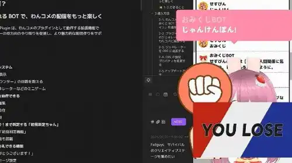

# おみくじ BOT じゃんけん OmikujiBot HondaJanken

最終更新日：2025/09/03

配信者のためのコメントアプリ「わんコメ」で使用できる、 テンプレートです。

この内容は、BOOTH で配布している、 [おみくじ BOT ゆっくり霊夢&魔理沙 OmikujiBot ReimuMarisa](https://pintocuru.booth.pm/items/5471598) の readme となります。

## はじめに（Intro）

- [わんコメ](https://onecomme.com/) の機能を前提としたソフトウェアです。
- 本ソフトウェアの利用は自己責任でお願いいたします。
- 仕様は予告なく変更される場合があります。

## このテンプレートは何？（Features）

### 「じゃんけん」ミニゲームが楽しめるジェネレーター

- わんコメに BOT 機能を付与するジェネレーター【おみくじ BOT】を使った、テンポ良くレスポンスしてくれるミニゲームです。
  - インストールやカスタマイズ等、機能に関する内容は [おみくじ BOT OmikujiBot for わんコメ README](../OmikujiBot/README.md) をご覧ください。

## インストール方法 (Installation)

テンプレートのインストールは、[テンプレートの導入方法](/docs/TemplateInstall/README.md) をご覧ください。

### 【推奨】おみくじ BOT 用 WordParty の導入について

この【おみくじ BOT OmikujiBot】は、[おみくじ BOT 用 WordParty](https://booth.pm/ja/items/6048048) の演出を前提として作られています。この WordParty を導入することで、配信がより華やかで視覚的に楽しいものになります。

- キャラクターのセリフに、効果音やアニメーションが追加で表示されるように。
- おみくじの結果やじゃんけんの勝敗が、視覚的にわかりやすく表示されます。

詳しくは [おみくじ BOT 用 WordParty README](/docs/OmikujiBot/README.md) をご覧ください。

## つかいかた (Usage)

コメントをトリガーにした「ミニゲーム」により、**コメント数やリスナーの視聴時間増加**に貢献します。

- **朝活・雑談配信での活用**
  - コメントがゲームの「きっかけ」となり、**視聴者とのやりとりが活性化**します。
  - コメントに**リアクションが生まれる**ことで、コメントする楽しさが生まれ、**自然とコメント数が増加**します。

### じゃんけん

- じゃんけんの勝率は 1/2、あいこを「負け」とカウントしても、1/3 だと考えていませんか。
- この「じゃんけん」は、じゃんけんの猛者 [「ケイスケ ホンダ」](https://dic.pixiv.net/a/%E6%9C%AC%E7%94%B0%E3%81%A8%E3%81%98%E3%82%83%E3%82%93%E3%81%91%E3%82%93) を導入することにより、勝率をたったの 5% まで劇的に減少させることに成功しました。
	- 負けた時の「挑発的なコメント」が豊富です
	- 誰が勝つか、ユーザー同士で競い合え、コメント数も増加します。
- [勝ったらコーラ1本プレゼント！](https://www.j-cast.com/2019/04/17355553.html)

### コラム：配信プラットフォームへの影響

- 多くの配信プラットフォームは、**コメント数や視聴時間を「盛り上がり」の指標**としています。
- これらの指標が増加すると、アルゴリズムによって「注目コンテンツ」として選ばれやすくなります。
- 本アプリは、その仕組みを意識的に活用し、コメントを誘発することで配信の可視性を高めることを目的としています。

## カスタマイズ（Customization）

### コンフィグエディターで自由におみくじを編集できる

すべての配布パッケージには、**コンフィグエディター**（おみくじデータ編集用アプリ）が付属しています。

アプリと同じフォルダにある **`ConfigMaker.html`** を開くと起動できます。

配布パッケージの種類によっては、一部機能が制限または非表示になっている場合があります。

詳しくは [おみくじ BOT コンフィグエディター README](/docs/OmikujiBot_ConfigEditor/README.md) をご覧ください。

- おみくじの内容は、あなたの配信に合わせて**内容を自由にカスタマイズ**できます。
- ただし、使用している**キャラクターには著作権があります**ので、原作やイラスト制作者の方々へのご配慮をお願いします。

## よくある質問 (FAQ)

わんコメの機能については [よくある質問](https://onecomme.com/docs/faq) または [導入ガイド](https://onecomme.com/docs/guide) をご参照ください。

### システム関連

#### Q. ギフト・スパチャされた時にだけ発動させたい

#### Q. メンバー限定で発動させたい

#### Q. 1 日 1 回と、回数を制限したい

A: [おみくじ BOT コンフィグエディター](../OmikujiBot_ConfigEditor/README.md) で設定が可能です。

## トラブルシューティング (Troubleshooting)

わんコメの機能については [トラブルシューティング](https://onecomme.com/docs/trouble-shooting) または [導入ガイド](https://onecomme.com/docs/guide) をご参照ください。

#### Q. 棒読みちゃんの音が鳴らない

#### Q. OBS 側で非表示にしていても、BOT のコメントが勝手に動いてしまう

#### Q. コメントでおみくじが反応しない

#### Q. おみくじが Youtube のコメントに反映されていない

#### Q. おみくじを連続で行うとコメントが反映されなくなる

A. [おみくじ BOT README トラブルシューティング](../OmikujiBot/README.md) をお読みください。

#### Q. WordParty の音が配信に出ない

わんコメ公式 [テンプレートの導入方法](../TemplateInstall/README.md) をご覧ください

## クレジット（Credits）

- コーラを持ってじゃんけんする女性
  生成：Google Gemini <https://gemini.google.com/>

### 素材の取り扱いについて

- イラスト素材・動画・音源の再配布は禁止
- イラストや音源の利用については、各配布サイトの利用規約をご確認ください。

## ライセンス（License）

### パッケージデータ (通常版)

- 【CC-BY 4.0】 このパッケージのデータ (Json データ) は、 [Creative Commons Attribution 4.0 International (CC-BY 4.0)](https://creativecommons.org/licenses/by/4.0/) に基づいて提供されます。
- クレジット表記をすれば、改変・再利用が可能です。
- パッケージに含まれるイラスト画像等は、CC-BY 4.0 の対象外です。

### アプリ本体（ジェネレーター・コンフィグエディター）

- Copyright © 2025 Pintocuru(せすじピンとしてます)
- 本ソフトウェア (おみくじ BOT) は、著作権者の許可なく再配布することを禁じます。
- 本ソフトウェアは、BOOTH にて提供される各パッケージに含まれる形でのみ配布されます。
- 改変・逆コンパイル・再販売も禁止されています。

## バージョン情報 (Version)

### ver.250903

- おみくじ BOT のバージョン: v1.0.1
- [おみくじ BOT ゆっくり霊夢&魔理沙](/docs/OmikujiBotReimuMarisa/README.md) の機能「じゃんけん」を分離する形で新規作成

---

作成者：せすじピンとしてます @pintocuru

[Twitter](https://twitter.com/pintocuru) | [YouTube](https://www.youtube.com/@pintocuru)