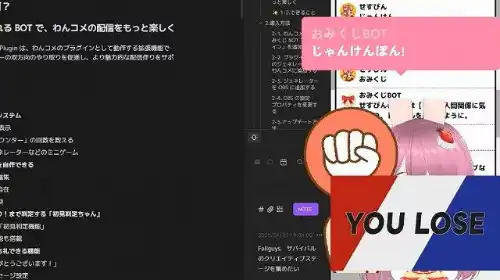

# おみくじ BOT じゃんけん OmikujiBot HondaJanken

最終更新日：<% tp.date.now('YYYY/MM/DD') %>

 テンプレートです。

この内容は、BOOTH で配布している、 [おみくじ BOT ゆっくり霊夢&魔理沙 OmikujiBot ReimuMarisa](https://pintocuru.booth.pm/items/5471598) の readme となります。

## このテンプレートは何？（Features）

### 「じゃんけん」ミニゲームが楽しめるジェネレーター

- わんコメに BOT 機能を付与するジェネレーター【おみくじ BOT】を使った、テンポ良くレスポンスしてくれるミニゲームです。
  

## つかいかた (Usage)

## カスタマイズ（Customization）

## クレジット（Credits）

- コーラを持ってじゃんけんする女性
  生成：Google Gemini <https://gemini.google.com/>

## バージョン情報 (Version)

### ver.250903

- おみくじ BOT のバージョン: v1.0.0
- [おみくじ BOT ゆっくり霊夢&魔理沙](/docs/OmikujiBotReimuMarisa/README.md) の機能「じゃんけん」を分離する形で新規作成

<%* await tp.user.expandEmbeds(tp) %>
