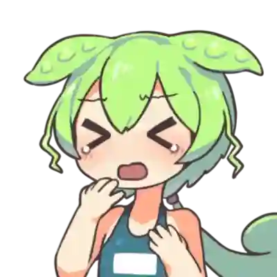

# おみくじ BOT みんなのずんだもん OmikujiBot EveryoneZunda README

最終更新日：2025/12/07

配信者のためのコメントアプリ「わんコメ」で使用できる、 テンプレートです。

この内容は、BOOTH で配布している、 [おみくじ BOT みんなのずんだもん OmikujiBot EveryoneZunda](https://pintocuru.booth.pm/items/6053855) の readme となります。

## はじめに（Intro）

- [わんコメ](https://onecomme.com/) の機能を前提としたソフトウェアです。
- 本ソフトウェアの利用は自己責任でお願いいたします。
- 仕様は予告なく変更される場合があります。

## このテンプレートは何？（Features）

### ずんだもんがリスナーを歓迎してくれるジェネレーター

- わんコメに BOT 機能を付与するジェネレーター【おみくじ BOT】を使った、ずんだもんが懸命に頑張るテンプレートです。
- 解説動画や配信の読み上げでも良く使われる、「ずんだもん」を BOT キャラクターにしました。元気に明るく、リスナーを迎えてくれます。ちょっと生意気なのも、可愛いポイント。
- イラストは 坂本アヒル さんのを使用してます。
  - インストールやカスタマイズ等、機能に関する内容は [おみくじ BOT OmikujiBot README](https://github.com/Pintocuru/OmikujiBot-Docs/blob/main/core/OmikujiBot/README.md) をご覧ください。

### ずんだもん のキャラクター設定

このジェネレーターでは、ずんだもんを以下のようなキャラクターとして登場させています。

- 誰に対しても素直に喜び、ちょっとまごつきながらも、歓迎してくれる
  - 他人は呼び捨て、オマエ呼ばわりと、ちょっと失礼な場面も。
- 初見詐欺に対しては、妙に煽り気味で上から目線（のように見える）
- 何故か芸人ネタを持ち込む。[世界的な大スター](https://ja.wikipedia.org/wiki/%E3%81%A8%E3%81%AB%E3%81%8B%E3%81%8F%E6%98%8E%E3%82%8B%E3%81%84%E5%AE%89%E6%9D%91) が好きなようだ。

### キャラクターの立ち位置・セリフについて

- 原作とは異なる「二次創作」キャラクターのため、一般的に知られているようなキャラクター像とは異なる言動やセリフが見られる場合があります。
- 原作では「プライドの高い不幸キャラ」なのですが、おみくじ BOT のずんだもんは他人への思いやりが強かったり、不幸さが薄いかもしれません。ずんだもち 1 個贈呈なのだ。

## インストール (Installation)

> テンプレートのインストールは、[わんコメ カスタムテンプレートの導入方法](https://github.com/Pintocuru/OmikenReadme/blob/main/docs/TemplateInstall/README.md) をご覧ください。

### アップグレード

> バージョンアップは [github](https://github.com/Pintocuru/OmikujiBot-Docs/releases/latest) にて配布しております。
> 現在のバージョンについては、コンフィグエディターを開くか、readme.txt でご確認下さい。

- **アップグレード手順**：
  1. リリースノートの下部にある「Assets」から、「OmikujiBot」と書かれたファイルをダウンロード
  2. ダウンロードしたファイルを解凍
  3. わんコメを開き、「テンプレート」画面から、アップグレードしたいテンプレートを選び、右側の「フォルダを開く」をクリック
  4. 念のため、フォルダ内の `omikujiData.js` を別の場所にバックアップ
  5. 解凍したファイルを、該当フォルダに上書き保存
  6. コンフィグエディターを起動し、バージョンが最新になっていることを確認
- **注意**：アップグレード後、一部設定がデフォルトに戻る場合があります。バックアップは必ず行って下さい。

### 【推奨】おみくじ BOT 演出用 WordParty2.0 の導入について

この【おみくじ BOT OmikujiBot】は、[おみくじ BOT 演出用 WordParty2.0](https://pintocuru.booth.pm/items/7670038) の演出を前提として作られています。この WordParty を導入することで、配信がより華やかで視覚的に楽しいものになります。

- キャラクターのセリフに、効果音やアニメーションが追加で表示されるように。
- おみくじの結果やじゃんけんの勝敗が、視覚的にわかりやすく表示されます。

詳しくは [おみくじ BOT 演出用 WordParty2.0 README](https://github.com/Pintocuru/OmikujiBot-Docs/blob/main/core/OmikenWordParty/README.md) をご覧ください。

## PRO 版へのアップグレード (Installation)

### PRO(有料) 版でできること

- PRO 版は以下の機能が追加されます
  - コンフィグエディターの「テンプレートの読み込み・出力」が可能になります。
  - フキダシのフォント設定・アニメーション設定を自在に選べるようになります。
- PRO 版をご購入いただくと、配布ファイル内の `readme.txt` にライセンスキーが記載されています。
- コンフィグエディターの「表示設定 ＞ エディター設定」に、ライセンスキーを入力する欄がありますので、そこへコピー＆ペーストしてください。
- PRO 版へのインストールに関する方法は [PRO(有料) 版へのアップグレードの方法](https://github.com/Pintocuru/OmikujiBot-Docs/tree/main/core/OmikujiBot#pro%E6%9C%89%E6%96%99-%E7%89%88%E3%81%B8%E3%81%AE%E3%82%A2%E3%83%83%E3%83%97%E3%82%B0%E3%83%AC%E3%83%BC%E3%83%89%E3%81%AE%E6%96%B9%E6%B3%95) をご覧ください。

### PRO 版へのアップグレードの方法

ライセンスキーを使ってアップグレードできます。

1. [おみくじ BOT ストロベリーショコラ OmikujiBot StrawberryChocolate](https://pintocuru.booth.pm/items/7733810) より **【PRO 版＋ライセンスキー】** を購入する
2. ダウンロードした PRO 版の zip ファイル内にある `readme.txt` を開き、ライセンスキーをコピーする
3. コンフィグエディターのアプリを開き、**表示設定 ＞ エディター設定** を開く
4. 「ライセンスキー」欄にコピーしたキーを貼り付ける
5. 「設定を出力」ボタンをクリックして、既存の js ファイルを上書きする

このアップグレードを行う場合、PRO 版に入っているデータは「テンプレート読み込み (JSON)」から読み込んでください。

### 過去に上記以外の方法で PRO 版をご購入いただいた方

ライセンスキーはそのまま有効です。今後も PRO 版としてご利用いただけます。アップデートは無償で提供されますので安心してお使いください。

## つかいかた (Usage)

### おみくじを発動させるには

- 配信で実際に使う前に、**わんコメのコメントテスターで動作確認**することをおすすめします。
- コメントテスターは、わんコメのメニューから「コメントテスター」を選択してご利用ください。
- OBS 等のストリーミング配信アプリに正しく導入されていれば、コメントに「おみくじ」などのキーワードを送信することで発動します。

### ずんだもんのおみくじ

> 発動ワード : `おみくじ` / `omikuji`

- 巫女さん手製のおみくじを、ずんだもんが読んでくれます。
- 「残念賞」に関する内容がすべて白紙だったため、代わりにずんだもんが一発芸をしてくれます。
  - 裸芸が多いのは [配布画像データ](https://www.pixiv.net/artworks/92641351) が由来です。

### じゃんけん

> 発動ワード : `じゃんけん` / `janken`/ `グー`/ `チョキ`/ `パー`

- じゃんけんの勝率は 1/2、あいこを「負け」とカウントしても、1/3 だと考えていませんか。
- この「じゃんけん」は、じゃんけんの猛者 [「ケイスケ ホンダ」](https://dic.pixiv.net/a/%E6%9C%AC%E7%94%B0%E3%81%A8%E3%81%98%E3%82%83%E3%82%93%E3%81%91%E3%82%93) を導入することにより、勝率をたったの 5% まで劇的に減少させることに成功しました。
  - 負けた時の「挑発的なコメント」が豊富です
  - 誰が勝つか、ユーザー同士で競い合え、コメント数も増加します。
- [勝ったらコーラ 1 本プレゼント！](https://www.j-cast.com/2019/04/17355553.html)

### 初見判定ちゃん

> 発動条件 : 初回コメント

- 初めてのコメント、久しぶり（約 1 週間ぶり）、その配信での初回コメントに対して挨拶します。
  - 判定には「わんコメ」のデータを参照します。
  - そのため、実際には「初見」でなくても、データにユーザー情報がなければ「初見」と判定されます。ご了承ください。
- 初見でもないのに「初見」とコメントすると…？

#### コメントテスターでのテスト方法

- おみくじ BOT v1.2 以降では、コメントテスターの「その他」項目から以下にチェックを入れることで「初見判定ちゃん」のテストが可能です。
  - `NEWコメント` : 初見
  - `NEWコメント` + `再訪` : 久しぶり（前回コメントから 1 週間以上経過）
  - `再訪` : 配信枠での初回コメント

#### 初見詐欺

> 発動ワード : `初見(?!さん)` / `所見`/ `はじめまして`
> 発動条件 : 個人コメント数(総数)が 6 以上であるとき

- 実際には初見でないのに「初見」とコメントしたユーザーに対して、ツッコミで返答します。
  - コメント数が 5 回以下の場合は、許容バージョンとして「ホントの初見」というデータも用意しています。
- 複数アカウントを利用している場合など、同一人物であってもアカウントが異なる場合、わんコメでは区別できないため、「初見」と判定されてしまいます。

### ギフトのお礼

> 発動条件 : 1 ポイント以上のスパチャ・ギフト・ビット・お茶爆等

- ギフトに対して、BOT コメントを表示することが出来ます。
- ギフトに対するリアクションは、わんコメのギフト用読み上げ機能や、 WordPatry 機能で様々な演出が可能なので、控えめに設定しています。

### コメント数チェック (配信内・個人総合)

> 発動条件 : 配信内で 50 コメント毎、個人で 100 コメント毎

- 配信内でのコメント数と、個人の総合コメント数を参照して、特定の回数で BOT がコメントしてくれます。
- デフォルトでは、50 回、または 100 回ごとにお知らせのトースト表示をしてくれます。

### コメント数を確認する

> 発動ワード : `コメント`

- これまでに投稿したコメント数を、わんコメが起動していた配信枠の範囲でカウントし、結果をトースト通知で表示します。

## カスタマイズ（Customization）

### 「コンフィグエディター」で自由におみくじを編集できる

- すべての配布パッケージには、**コンフィグエディター**（おみくじデータ編集用アプリ）が付属しています。
- アプリと同じフォルダにある **`ConfigMaker.html`** を開くと起動できます。
- 配布パッケージの種類によっては、一部機能が制限または非表示になっている場合があります。
- 詳しくは [おみくじ BOT コンフィグエディター README](https://github.com/Pintocuru/OmikujiBot-Docs/blob/main/core/ConfigEditor/README.md) をご覧ください。
- おみくじの内容は、あなたの配信に合わせて**内容を自由にカスタマイズ**できます。
- ただし、使用している**キャラクターには著作権があります**ので、原作やイラスト制作者の方々へのご配慮をお願いします。

## よくある質問 (FAQ)

> わんコメの機能については [よくある質問](https://onecomme.com/docs/faq) または [導入ガイド](https://onecomme.com/docs/guide) をご参照ください。

### システム関連

#### Q. ギフト・スパチャされた時にだけ発動させたい

#### Q. メンバー限定で発動させたい

#### Q. 1 日 1 回と、回数を制限したい

A: [おみくじ BOT コンフィグエディター](https://github.com/Pintocuru/OmikujiBot-Docs/blob/main/core/ConfigEditor/README.md) で設定が可能です。

## トラブルシューティング (Troubleshooting)

わんコメの機能については [トラブルシューティング](https://onecomme.com/docs/trouble-shooting) または [導入ガイド](https://onecomme.com/docs/guide) をご参照ください。

#### Q. 棒読みちゃんの音が鳴らない

#### Q. OBS 側で非表示にしていても、BOT のコメントが勝手に動いてしまう

#### Q. コメントでおみくじが反応しない

#### Q. おみくじが Youtube のコメントに反映されていない

#### Q. おみくじを連続で行うとコメントが反映されなくなる

A. [おみくじ BOT README トラブルシューティング](https://github.com/Pintocuru/OmikujiBot-Docs/tree/main/core/OmikujiBot#%E3%83%88%E3%83%A9%E3%83%96%E3%83%AB%E3%82%B7%E3%83%A5%E3%83%BC%E3%83%86%E3%82%A3%E3%83%B3%E3%82%B0-troubleshooting) をお読みください。

#### Q. WordParty の音が配信に出ない

わんコメ公式の [音声を配信にのせる方法](https://onecomme.com/docs/feature/wordparty#%E9%9F%B3%E5%A3%B0%E3%82%92%E9%85%8D%E4%BF%A1%E3%81%AB%E3%81%AE%E3%81%9B%E3%82%8B%E6%96%B9%E6%B3%95) をご覧ください

## クレジット（Credits）

#### ずんだもん

- ずんだもん ずんだもん立ち絵素材 - 坂本アヒルのイラスト - pixiv
  - <https://www.pixiv.net/artworks/92641351>

### 素材の取り扱いについて

1. 本アプリに含まれる素材は、各権利者からの許諾を得て使用しています。
2. 素材は、配信でのみ使用してください。抽出・再配布は禁止です。
3. 詳細は各配布サイトの利用規約をご参照ください。

オマエ！どうしてこんな格好をさせるのだ！ひどい仕打ちなのだ！

## ライセンス（License）

### パッケージデータ

- 【CC-BY 4.0】 このパッケージのデータ (Json データ) は、 [Creative Commons Attribution 4.0 International (CC-BY 4.0)](https://creativecommons.org/licenses/by/4.0/) に基づいて提供されます。
- クレジット表記をすれば、改変・再利用が可能です。
- パッケージに含まれるイラスト画像等は、CC-BY 4.0 の対象外です。

### アプリ本体（ジェネレーター・コンフィグエディター）

- Copyright © 2025 Pintocuru(せすじピンとしてます)
- 本ソフトウェア (おみくじ BOT) は、著作権者の許可なく再配布することを禁じます。
- 本ソフトウェアは、Github、または BOOTH にて提供される各パッケージに含まれる形でのみ配布されます。
- 改変・逆コンパイル・再販売も禁止されています。

## バージョン情報 (Version)

### ver.251206

- **おみくじ BOT のバージョン**: v1.4.3
- 今後は【通常版】のみのリリースとなります。
  - これまで PRO 版にはミニゲームが搭載されていましたが、今後は個別パッケージとして提供します。
    - 搭載されていたミニゲームは以下の 2 パッケージです。
      - [おみくじ BOT ボンバースロット OmikujiBot BomberSpin - ピンとくる企画 - BOOTH](https://pintocuru.booth.pm/items/7730686)
      - [おみくじ BOT スイカジェネレーター + カボチャ&クジラ OmikujiBot GouseiSuika - ピンとくる企画 - BOOTH](https://pintocuru.booth.pm/items/5813323)
  - 今後は【通常版】をダウンロードしてご利用いただくか、JSON データをインポートしてご利用ください。

### ver.250910-v1.1.0

- おみくじ BOT のバージョン: v1.1.0

### ver.250828-v0.8.0-Beta.09

- おみくじ BOT のバージョン: v0.8.0-Beta.09
- 「おみくじ BOT」のバージョンアップに伴い、内容をリニューアルしました。
  - じゃんけんでは「僕」と言い換えています。
  - 公式に合わせ、ユーザーへの呼び方を「さん」付けから、呼び捨てにしました。
  - ユーザーに対して「オマエ」と呼ぶパターンを増やしました。
    - このアップデートにより、少しだけ、幸が薄くなりました。

### ver.240830

- 「初見判定ちゃん ずんだもん」としてリリース。

---

作成者：Pintocuru(せすじピンとしてます) @pintocuru

[Twitter](https://twitter.com/pintocuru) | [YouTube](https://www.youtube.com/@pintocuru)
