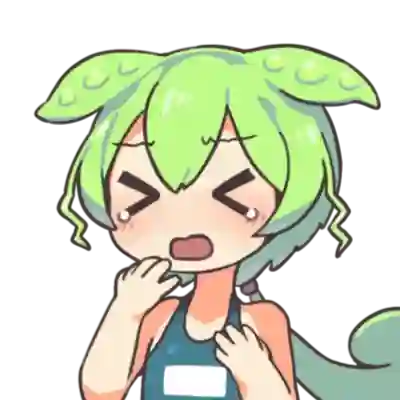

# おみくじ BOT みんなのずんだもん OmikujiBot EveryoneZunda

最終更新日：<% tp.date.now('YYYY/MM/DD') %>

 テンプレートです。

 [おみくじ BOT みんなのずんだもん OmikujiBot EveryoneZunda](https://pintocuru.booth.pm/items/6053855) の readme となります。

## このテンプレートは何？（Features）

### ずんだもんがリスナーを歓迎してくれるジェネレーター

- わんコメに BOT 機能を付与するジェネレーター【おみくじ BOT】を使った、ずんだもんが懸命に頑張るテンプレートです。
- 解説動画や配信の読み上げでも良く使われる、「ずんだもん」を BOT キャラクターにしました。元気に明るく、リスナーを迎えてくれます。ちょっと生意気なのも、可愛いポイント。
- イラストは 坂本アヒル さんのを使用してます。
  

### ずんだもん のキャラクター設定

このジェネレーターでは、ずんだもんを以下のようなキャラクターとして登場させています。

- 誰に対しても素直に喜び、ちょっとまごつきながらも、歓迎してくれる
  - 他人は呼び捨て、オマエ呼ばわりと、ちょっと失礼な場面も。
- 初見詐欺に対しては、妙に煽り気味で上から目線（のように見える）
- 何故か芸人ネタを持ち込む。[世界的な大スター](https://ja.wikipedia.org/wiki/%E3%81%A8%E3%81%AB%E3%81%8B%E3%81%8F%E6%98%8E%E3%82%8B%E3%81%84%E5%AE%89%E6%9D%91) が好きなようだ。

- 原作では「プライドの高い不幸キャラ」なのですが、おみくじ BOT のずんだもんは他人への思いやりが強かったり、不幸さが薄いかもしれません。ずんだもち 1 個贈呈なのだ。

## つかいかた (Usage)

### ずんだもんのおみくじ

> 発動ワード : `おみくじ` / `omikuji`

- 巫女さん手製のおみくじを、ずんだもんが読んでくれます。
- 「残念賞」に関する内容がすべて白紙だったため、代わりにずんだもんが一発芸をしてくれます。
	- 裸芸が多いのは [配布画像データ](https://www.pixiv.net/artworks/92641351) が由来です。

## カスタマイズ（Customization）

## クレジット（Credits）

#### ずんだもん

- ずんだもん ずんだもん立ち絵素材 - 坂本アヒルのイラスト - pixiv
	- <https://www.pixiv.net/artworks/92641351>

オマエ！どうしてこんな格好をさせるのだ！ひどい仕打ちなのだ！

## バージョン情報 (Version)

### ver.251206

- **おみくじ BOT のバージョン**: v1.4.3
- 今後は【通常版】のみのリリースとなります。
  - これまで PRO 版にはミニゲームが搭載されていましたが、今後は個別パッケージとして提供します。
    - 搭載されていたミニゲームは以下の 2 パッケージです。
      - [おみくじ BOT ボンバースロット OmikujiBot BomberSpin - ピンとくる企画 - BOOTH](https://pintocuru.booth.pm/items/7730686)
      - [おみくじ BOT スイカジェネレーター + カボチャ&クジラ OmikujiBot GouseiSuika - ピンとくる企画 - BOOTH](https://pintocuru.booth.pm/items/5813323)
  - 今後は【通常版】をダウンロードしてご利用いただくか、JSON データをインポートしてご利用ください。

### ver.250910-v1.1.0

- おみくじ BOT のバージョン: v1.1.0

### ver.250828-v0.8.0-Beta.09

- おみくじ BOT のバージョン: v0.8.0-Beta.09
- 「おみくじ BOT」のバージョンアップに伴い、内容をリニューアルしました。
  - じゃんけんでは「僕」と言い換えています。
  - 公式に合わせ、ユーザーへの呼び方を「さん」付けから、呼び捨てにしました。
  - ユーザーに対して「オマエ」と呼ぶパターンを増やしました。
    - このアップデートにより、少しだけ、幸が薄くなりました。

### ver.240830

- 「初見判定ちゃん ずんだもん」としてリリース。

<%* await tp.user.expandEmbeds(tp) %>
