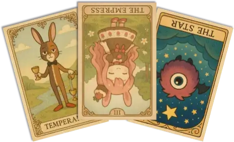

# おみくじ BOT ストロベリーショコラ OmikujiBot StrawberryChocolate

最終更新日：2025/12/06

配信者のためのコメントアプリ「わんコメ」で使用できる、 テンプレートです。

この内容は、BOOTH で配布している、 [おみくじBOT ストロベリーショコラ OmikujiBot StrawberryChocolate](https://pintocuru.booth.pm/items/7733810) の readme となります。

## はじめに（Intro）

- [わんコメ](https://onecomme.com/) の機能を前提としたソフトウェアです。
- 本ソフトウェアの利用は自己責任でお願いいたします。
- 仕様は予告なく変更される場合があります。

## このテンプレートは何？（Features）

### わんコメに BOT 機能を付与するジェネレーター

- 【おみくじ BOT OmikujiBot】は、わんコメに BOT 機能を付与するジェネレーターです。
- 特定のワード (おみくじ 等) と、チャットに投稿することで、ランダムな結果を配信画面に表示します。
- 初見さん (初めてのコメント) や、通算 100 回目のコメントなど、特定の条件で発動し、配信画面に表示する機能があります。
- ピンとくる企画のオリジナルキャラクター「ストロベリーショコラ」を BOT キャラクターにしました。
	- 世話好きでお姉さんらしい雰囲気を持ち、甘く丁寧な接客が魅力です。

### シーン別・活用例

- **朝活配信**
  - 今日 1 日の運勢を占う「おみくじ」で、配信が賑やかに。
- **雑談配信**
  - リスナーのコメントに対してキャラクターがボケたりツッコミを入れたりして、自然に会話が広がります。
- **ゲーム配信**
  - ゲームに集中していても、BOT が代わりに挨拶してくれるので、初見さんを見逃しません。

### ストロベリーショコラのキャラクター設定

- **性格**
	- 世話好きで面倒見がよく、困っている人を見ると放っておけないタイプ。
	- お姉さんらしい落ち着きと包容力を持ち、相手を安心させる雰囲気があります。
- **口調**
	- 丁寧で柔らかい言葉遣いが基本。
	- 相手を優しく包み込むようなトーンで話し、時折ユーモアを交えて場を和ませます。
	- 呼びかけは「〜さん」と親しみを込めつつ、少し甘えさせてくれるようなニュアンスを持っています。

## インストール (Installation)

> テンプレートのインストールは、[わんコメ カスタムテンプレートの導入方法](https://github.com/Pintocuru/OmikenReadme/blob/main/docs/TemplateInstall/README.md) をご覧ください。

### アップグレード

> バージョンアップは [github](https://github.com/Pintocuru/OmikujiBot-Docs/releases/latest) にて配布しております。
> 現在のバージョンについては、コンフィグエディターを開くか、readme.txt でご確認下さい。

- **アップグレード手順**：
  1. リリースノートの下部にある「Assets」から、「OmikujiBot」と書かれたファイルをダウンロード
  2. ダウンロードしたファイルを解凍
  3. わんコメを開き、「テンプレート」画面から、アップグレードしたいテンプレートを選び、右側の「フォルダを開く」をクリック
  4. 念のため、フォルダ内の `omikujiData.js` を別の場所にバックアップ
  5. 解凍したファイルを、該当フォルダに上書き保存
  6. コンフィグエディターを起動し、バージョンが最新になっていることを確認
- **注意**：アップグレード後、一部設定がデフォルトに戻る場合があります。バックアップは必ず行って下さい。

### 【推奨】おみくじ BOT 演出用 WordParty2.0 の導入について

この【おみくじ BOT OmikujiBot】は、[おみくじBOT 演出用WordParty2.0](https://pintocuru.booth.pm/items/7670038) の演出を前提として作られています。この WordParty を導入することで、配信がより華やかで視覚的に楽しいものになります。

- キャラクターのセリフに、効果音やアニメーションが追加で表示されるように。
- おみくじの結果やじゃんけんの勝敗が、視覚的にわかりやすく表示されます。

詳しくは [おみくじ BOT 用 WordParty README](https://github.com/Pintocuru/OmikujiBot-Docs/blob/main/core/OmikenWordParty/README.md) をご覧ください。

## PRO 版へのアップグレード (Installation)

### PRO(有料) 版でできること

- PRO 版は以下の機能が追加されます
	- コンフィグエディターの「テンプレートの読み込み・出力」が可能になります。
	- フキダシのフォント設定・アニメーション設定を自在に選べるようになります。
- PRO 版をご購入いただくと、配布ファイル内の `readme.txt` にライセンスキーが記載されています。
- コンフィグエディターの「表示設定 ＞ エディター設定」に、ライセンスキーを入力する欄がありますので、そこへコピー＆ペーストしてください。
- PRO 版へのインストールに関する方法は [PRO(有料) 版へのアップグレードの方法](https://github.com/Pintocuru/OmikujiBot-Docs/tree/main/core/OmikujiBot#pro%E6%9C%89%E6%96%99-%E7%89%88%E3%81%B8%E3%81%AE%E3%82%A2%E3%83%83%E3%83%97%E3%82%B0%E3%83%AC%E3%83%BC%E3%83%89%E3%81%AE%E6%96%B9%E6%B3%95) をご覧ください。

### PRO 版へのアップグレードの方法

ライセンスキーを使ってアップグレードできます。

1. [おみくじBOT ストロベリーショコラ OmikujiBot StrawberryChocolate](https://pintocuru.booth.pm/items/7733810) より **【PRO 版＋ライセンスキー】** を購入する
2. ダウンロードした PRO 版の zip ファイル内にある `readme.txt` を開き、ライセンスキーをコピーする
3. コンフィグエディターのアプリを開き、**表示設定 ＞ エディター設定** を開く
4. 「ライセンスキー」欄にコピーしたキーを貼り付ける
5. 「設定を出力」ボタンをクリックして、既存の js ファイルを上書きする

このアップグレードを行う場合、PRO 版に入っているデータは「テンプレート読み込み (JSON)」から読み込んでください。

### 過去に上記以外の方法で PRO 版をご購入いただいた方

ライセンスキーはそのまま有効です。今後も PRO 版としてご利用いただけます。アップデートは無償で提供されますので安心してお使いください。

## つかいかた (Usage)

### おみくじを発動させるには

- 配信で実際に使う前に、**わんコメのコメントテスターで動作確認**することをおすすめします。
- コメントテスターは、わんコメのメニューから「コメントテスター」を選択してご利用ください。
- OBS 等のストリーミング配信アプリに正しく導入されていれば、コメントに「おみくじ」などのキーワードを送信することで発動します。

### タロットカード

> 発動ワード : `タロット` / `タロットカード`/ `tarot`

- 使用するカードは、大アルカナ 22 枚。正位置・逆位置を含めた全 44 種類の結果が用意されています。
	- カードの意味はしっかり本格派。軽い気持ちで引いても、ふと心に残るかも。
	- [おみくじ BOT 用 WordParty](https://booth.pm/ja/items/6048048) を一緒に導入すると、稼働時にアニメーションが入ります。

- タロットに描かれているキャラクターは「おみくじ BOT」のキャラクターです。左から下記のような名前です。
	- カペラテ＝フロート
	- ストロベリーショコラ
	- マモノ (アサイーボール)

### じゃんけん

> 発動ワード : `じゃんけん` / `janken`/ `グー`/ `チョキ`/ `パー`

- じゃんけんの勝率は 1/2、あいこを「負け」とカウントしても、1/3 だと考えていませんか。
- この「じゃんけん」は、じゃんけんの猛者 [「ケイスケ ホンダ」](https://dic.pixiv.net/a/%E6%9C%AC%E7%94%B0%E3%81%A8%E3%81%98%E3%82%83%E3%82%93%E3%81%91%E3%82%93) を導入することにより、勝率をたったの 5% まで劇的に減少させることに成功しました。
	- 負けた時の「挑発的なコメント」が豊富です
	- 誰が勝つか、ユーザー同士で競い合え、コメント数も増加します。
- [勝ったらコーラ1本プレゼント！](https://www.j-cast.com/2019/04/17355553.html)

### 初見判定ちゃん

> 発動条件 : 初回コメント

- 初めてのコメント、久しぶり（約 1 週間ぶり）、その配信での初回コメントに対して挨拶します。
	- 判定には「わんコメ」のデータを参照します。
	- そのため、実際には「初見」でなくても、データにユーザー情報がなければ「初見」と判定されます。ご了承ください。
- 初見でもないのに「初見」とコメントすると…？

#### コメントテスターでのテスト方法

- おみくじ BOT v1.2 以降では、コメントテスターの「その他」項目から以下にチェックを入れることで「初見判定ちゃん」のテストが可能です。
	- `NEWコメント` : 初見
	- `NEWコメント` + `再訪` : 久しぶり（前回コメントから 1 週間以上経過）
	- `再訪` : 配信枠での初回コメント

#### 初見詐欺

> 発動ワード : `初見(?!さん)` / `所見`/ `はじめまして`
> 発動条件 : 総数の個人コメント数が 6 以上であるとき

- 実際には初見でないのに「初見」とコメントしたユーザーに対して、ツッコミで返答します。
	- コメント数が 5 回以下の場合は、許容バージョンとして「ホントの初見」というデータも用意しています。
- 複数アカウントを利用している場合など、同一人物であってもアカウントが異なる場合、わんコメでは区別できないため、「初見」と判定されてしまいます。

### ギフトのお礼

> 発動条件 : 1 ポイント以上のスパチャ・ギフト・ビット・お茶爆等

- ギフトに対して、BOT コメントを表示することが出来ます。
- ギフトに対するリアクションは、わんコメのギフト用読み上げ機能や、 WordPatry 機能で様々な演出が可能なので、控えめに設定しています。

### コメント数チェック (配信内・個人総合)

> 発動条件 : 配信内で 50 コメント毎、個人で 100 コメント毎

- 配信内でのコメント数と、個人の総合コメント数を参照して、特定の回数で BOT がコメントしてくれます。
- デフォルトでは、50 回、または 100 回ごとにお知らせのトースト表示をしてくれます。

### コメント数を確認する

> 発動ワード : `コメント`

- これまでに投稿したコメント数を、わんコメが起動していた配信枠の範囲でカウントし、結果をトースト通知で表示します。

## PRO 版ボーナスデータ (Usage)

配信で盛り上がる！ミニゲームシリーズが同梱されています。

### スイカジェネレーター

> 発動ワード : `suika` / `すいか`/ `スイカ`/ `西瓜`/ `suica`

- 米兜科技「合成大西瓜」 または Aladdin X「スイカゲーム」風のおみくじ。得点の高さを競います。
- たくさんのフルーツが降ってきます（おみくじ BOT 用 WordParty の導入を忘れずに！）
	- 特に操作は必要ありません。また、くっついたフルーツはシンカしません（演出です）
- 高得点時、スイカが大量に降ってきます！

### カボチャジェネレーター

> 発動ワード : `かぼちゃ` / `カボチャ`/ `南瓜`/ `pumpkin`

- Aladdin X「スイカゲーム」風のおみくじ。得点の高さを競います。
- スイカジェネレーターの亜種。アメ🍬とカボチャ🎃が追加。出現するほど得点も高くなる！？
- カボチャは激アツ！10000 点も夢じゃない！？

### クジラジェネレーター

> 発動ワード : `くじら` / `クジラ`/ `鯨`/ `whale`

- NekokujiraLab「クジラゲームオンライン」風のおみくじ。得点の高さを競います。
- スイカ・カボチャとは異なる、ハイリスク＆ハイリターンなモード。
- 高得点時はクジラたちがたくさん！いたずらシャチにはご用心。

### ボンバースロット

> 発動ワード : `スロット` / `すろっと`/ `slot`/ `ボンバー`/ `bomber`

- APPLI 「BOMBERSPIN2」 をイメージした、スロット風おみくじ。得点の高さを競います。
- ランクの高い図柄ほど高い得点に期待が持てます。
- 図柄は「チェリー」「オレンジ」「ぶどう」「スイカ」「ベル」「ハット」「コイン」「ダイヤモンド」の 8 つ。
	- 使える絵文字の関係上、プラム→ぶどう、BAR→コイン、セブン→ダイヤモンド に変更しています。
	- 「ダブルダウン」はありません。
- 突然の高得点！後半になるほど、高い得点が得られます。

### うさぎスロット

> 発動ワード : `うさぎ` / `ウサギ`/ `ドワーフ`/ `rabbit`/ `dwarf`/ `usagi`

- Nolimit City 「Fire in the Hole」 をイメージした、スロット風おみくじ。得点の高さを競います。
- うさぎ🐇が多いほど枚数獲得の期待大！
	- にんじん🥕が出るほど、うさぎが増える傾向にあります。雇ったのかな？
- コイン🪙、お札💴、ドル袋💰️、ダイヤモンド💎、TNT🧨・ツルハシ⛏️が飛び出るほど高得点！
- 上限は 5000 枚。目指せジャックポット！

### 桜吹雪スロット

> 発動ワード : `さくら` / `桜`/ `sakura`/ `桜吹雪`

- Wing 「FURAIJIN 風雷神」 をイメージした、スロット風おみくじ。得点の高さを競います。
- 図柄は「10(雨⛈️)」「J(月🌙)」「Q(竹🎍)」「K(波🌊)」「ACE(桜🌸)」「SSR(星🌟)」の 6 種類。
- 配当は非常に低いですが、掛け算により、指数的に得点が跳ね上がります。
- 花火が打ち上がるほど枚数獲得の期待大！
	- 枚数が多いほど、風神や雷神の出現率が上がります。
	- 上限達成で特別なキャラクターも…？
- 上限は 10000 枚。目指せジャックポット！

## カスタマイズ（Customization）

### 「コンフィグエディター」で自由におみくじを編集できる

- すべての配布パッケージには、**コンフィグエディター**（おみくじデータ編集用アプリ）が付属しています。
- アプリと同じフォルダにある **`ConfigMaker.html`** を開くと起動できます。
- 配布パッケージの種類によっては、一部機能が制限または非表示になっている場合があります。
- 詳しくは [おみくじ BOT コンフィグエディター README](https://github.com/Pintocuru/OmikujiBot-Docs/blob/main/core/ConfigEditor/README.md) をご覧ください。
- おみくじの内容は、あなたの配信に合わせて**内容を自由にカスタマイズ**できます。
- ただし、使用している**キャラクターには著作権があります**ので、原作やイラスト制作者の方々へのご配慮をお願いします。

## よくある質問 (FAQ)

> わんコメの機能については [よくある質問](https://onecomme.com/docs/faq) または [導入ガイド](https://onecomme.com/docs/guide) をご参照ください。

### システム関連

#### Q. ギフト・スパチャされた時にだけ発動させたい

#### Q. メンバー限定で発動させたい

#### Q. 1 日 1 回と、回数を制限したい

A: [おみくじ BOT コンフィグエディター](https://github.com/Pintocuru/OmikujiBot-Docs/blob/main/core/ConfigEditor/README.md) で設定が可能です。

## トラブルシューティング (Troubleshooting)

わんコメの機能については [トラブルシューティング](https://onecomme.com/docs/trouble-shooting) または [導入ガイド](https://onecomme.com/docs/guide) をご参照ください。

#### Q. 棒読みちゃんの音が鳴らない

#### Q. OBS 側で非表示にしていても、BOT のコメントが勝手に動いてしまう

#### Q. コメントでおみくじが反応しない

#### Q. おみくじが Youtube のコメントに反映されていない

#### Q. おみくじを連続で行うとコメントが反映されなくなる

A. [おみくじ BOT README トラブルシューティング](https://github.com/Pintocuru/OmikujiBot-Docs/tree/main/core/OmikujiBot#%E3%83%88%E3%83%A9%E3%83%96%E3%83%AB%E3%82%B7%E3%83%A5%E3%83%BC%E3%83%86%E3%82%A3%E3%83%B3%E3%82%B0-troubleshooting) をお読みください。

#### Q. WordParty の音が配信に出ない

わんコメ公式の [音声を配信にのせる方法](https://onecomme.com/docs/feature/wordparty#%E9%9F%B3%E5%A3%B0%E3%82%92%E9%85%8D%E4%BF%A1%E3%81%AB%E3%81%AE%E3%81%9B%E3%82%8B%E6%96%B9%E6%B3%95) をご覧ください

## クレジット（Credits）

### ストロベリーショコラのイラスト

- pintocuru(せすじピンとしてます)
- 本アプリ専用に制作された素材です。他の用途での使用・転載・再配布は禁止します。

## ライセンス（License）

### パッケージデータ

- 【CC-BY 4.0】 このパッケージのデータ (Json データ) は、 [Creative Commons Attribution 4.0 International (CC-BY 4.0)](https://creativecommons.org/licenses/by/4.0/) に基づいて提供されます。
- クレジット表記をすれば、改変・再利用が可能です。
- パッケージに含まれるイラスト画像等は、CC-BY 4.0 の対象外です。

### アプリ本体（ジェネレーター・コンフィグエディター）

- Copyright © 2025 Pintocuru(せすじピンとしてます)
- 本ソフトウェア (おみくじ BOT) は、著作権者の許可なく再配布することを禁じます。
- 本ソフトウェアは、Github、または BOOTH にて提供される各パッケージに含まれる形でのみ配布されます。
- 改変・逆コンパイル・再販売も禁止されています。

## バージョン情報 (Version)

### ver.251206

- おみくじ BOT のバージョン: v1.4.3
- 「おみくじ BOT」のサンプルデータ、またはライセンス付きの PRO 版として新規作成
	- 今後のリリースは、このバージョンを唯一の PRO 版（ライセンスキー付き）にする予定です
	- 他のリリースは「通常版」のほかに「支援版」として提供する場合もありますが、ライセンスキーはこのバージョンのみです。

---

作成者：Pintocuru(せすじピンとしてます) @pintocuru

[Twitter](https://twitter.com/pintocuru) | [YouTube](https://www.youtube.com/@pintocuru)