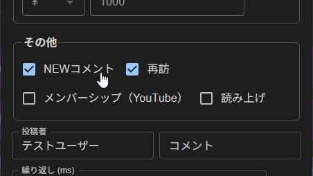

# おみくじ BOT ズッ友!つむぎ&ひまり OmikujiBot TsumugiHimari

最終更新日：2025/09/30

配信者のためのコメントアプリ「わんコメ」で使用できる、 テンプレートです。

この内容は、BOOTH で配布している、 [おみくじ BOT ズッ友!つむぎ&ひまり OmikujiBot Tsumugi & Himari]() の readme となります。

## はじめに（Intro）

- [わんコメ](https://onecomme.com/) の機能を前提としたソフトウェアです。
- 本ソフトウェアの利用は自己責任でお願いいたします。
- 仕様は予告なく変更される場合があります。

## このテンプレートは何？（Features）

### つむぎとひまりがノリノリでリスナーを歓迎してくれるジェネレーター

- わんコメに BOT 機能を付与するジェネレーター【おみくじ BOT】を使った、春日部つむぎ と 冥鳴ひまりが、「先輩後輩コンビ」として対応するテンプレートです。

### シーン別・活用例

- **朝活配信**
  - 今日 1 日の運勢を占う「おみくじ」で、配信が賑やかに。
- **雑談配信**
  - リスナーのコメントに対してキャラクターがボケたりツッコミを入れたりして、自然に会話が広がります。
- **ゲーム配信**
  - ゲームに集中していても、BOT が代わりに挨拶してくれるので、初見さんを見逃しません。

### 春日部つむぎ のキャラクター設定

このジェネレーターでは、春日部つむぎを以下のようなキャラクターとして登場させています。

- ギャルらしく、悪意のない、素直な性格です。
- 先輩にベタベタな 後輩の冥鳴ひまりに、少し戸惑うシーンも。
- 春日部つむぎは埼玉を応援していること、またこの script 制作者が埼玉県民であるため、埼玉に関する台詞を多めに入れています。
  - 万が一、何らかの誤った情報があったら、報告いただければと思います。修正します。

### 冥鳴ひまり のキャラクター設定

このジェネレーターでは、冥鳴ひまりを以下のようなキャラクターとして登場させています。

- 死神らしく、少し突き放した態度ながらも、つむぎ先輩が喜んでるのを見て、内心は嬉しいと思っています。
- 特定のコメントをするユーザーに対し「死ね」という表現もありますが、冥鳴ひまりのキャラクター性 (死神という設定) を尊重してのものです。必要に応じて、該当するおみくじを削除してください。

### キャラクターの立ち位置・セリフについて

- 原作とは異なる「二次創作」キャラクターのため、一般的に知られているようなキャラクター像とは異なる言動やセリフが見られる場合があります。

### 【使用上の注意】ネットスラングをふんだんに取り入れた内容となっています

- 人を選ぶ内容が多いです。リスナー層を十分考えて導入を検討して下さい。
- 「[冥鳴ひまり exVOICE](https://www.meimeihimari.com/goods)」を参照にしていますが、このボイスにないネタ多数もあります。
- 冥鳴ひまりのキャラクター性から、いわゆる「[淫夢要素](https://ja.wikipedia.org/wiki/%E5%A4%9A%E7%94%B0%E9%87%8E%E6%95%B0%E4%BA%BA)」も採用しています。
- 本テンプレートの使用に伴ういかなる損害についても責任を負いません。ご利用は自己責任でお願いします。

## インストール (Installation)

> テンプレートのインストールは、[わんコメ カスタムテンプレートの導入方法](https://github.com/Pintocuru/OmikenReadme/blob/main/docs/TemplateInstall/README.md) をご覧ください。

### アップグレード

> バージョンアップは [github](https://github.com/Pintocuru/OmikujiBot-Docs/releases/latest) にて配布しております。
> 現在のバージョンについては、コンフィグエディターを開くか、readme.txt でご確認下さい。

- **アップグレード手順**：
  1. リリースノートの下部にある「Assets」から、「OmikujiBot」と書かれたファイルをダウンロード
  2. ダウンロードしたファイルを解凍
  3. わんコメを開き、「テンプレート」画面から、アップグレードしたいテンプレートを選び、右側の「フォルダを開く」をクリック
  4. 念のため、フォルダ内の `omikujiData.js` を別の場所にバックアップ
  5. 解凍したファイルを、該当フォルダに上書き保存
  6. コンフィグエディターを起動し、バージョンが最新になっていることを確認
- **注意**：アップグレード後、一部設定がデフォルトに戻る場合があります。バックアップは必ず行って下さい。

### PRO(有料) 版へのアップグレードの方法

通常版を上書きすることで、アップグレードを行います。ダウンロードページから、通常版と PRO 版の両方をダウンロードし、通常版は上記に従いインストールを行ってください。

1. ダウンロードした PRO 版の zip ファイルを解凍する
2. わんコメを起動し、右上の…ボタン　＞　テンプレートを選択
3. カスタムタブから、インストールしたテンプレートを探し、「フォルダを開く」ボタンをクリック
4. 開いたフォルダに、解凍したファイルをすべて投げ込み、上書きする

### ライセンスキーでアップグレードする方法

既存のデータがあり、ファイルの上書きが難しい場合は、ライセンスキーを使ってアップグレードできます。

1. コンフィグエディターのアプリを開き、表示設定＞エディター設定を開く
2. PRO 版の zip ファイルの中にある「readme.txt」を開き、ライセンスキーをコピーする
3. コンフィグエディターの「ライセンスキー」欄にコピーした内容を貼り付ける
4. 「設定を出力」ボタンをクリックして、既存の js ファイルを上書きする

このアップグレードを行う場合、PRO 版に入っているデータは「テンプレート読み込み (JSON)」から読み込んでください。

### 【推奨】おみくじ BOT 用 WordParty の導入について

この【おみくじ BOT OmikujiBot】は、[おみくじ BOT 用 WordParty](https://booth.pm/ja/items/6048048) の演出を前提として作られています。この WordParty を導入することで、配信がより華やかで視覚的に楽しいものになります。

- キャラクターのセリフに、効果音やアニメーションが追加で表示されるように。
- おみくじの結果やじゃんけんの勝敗が、視覚的にわかりやすく表示されます。

詳しくは [おみくじ BOT 用 WordParty README](https://github.com/Pintocuru/OmikujiBot-Docs/blob/main/core/OmikenWordParty/README.md) をご覧ください。

## つかいかた (Usage)

### おみくじを発動させるには

- 配信で実際に使う前に、**わんコメのコメントテスターで動作確認**することをおすすめします。
- コメントテスターは、わんコメのメニューから「コメントテスター」を選択してご利用ください。
- OBS 等のストリーミング配信アプリに正しく導入されていれば、コメントに「おみくじ」などのキーワードを送信することで発動します。

### 初見判定ちゃん

> 発動条件 : 初回コメント

- 初めてのコメント、久しぶり（約 1 週間ぶり）、その配信での初回コメントに対して挨拶します。
  - 判定には「わんコメ」のデータを参照します。
  - そのため、実際には「初見」でなくても、データにユーザー情報がなければ「初見」と判定されます。ご了承ください。
- 初見でもないのに「初見」とコメントすると…？

#### コメントテスターでのテスト方法

- おみくじ BOT v1.2 以降では、コメントテスターの「その他」項目から以下にチェックを入れることで「初見判定ちゃん」のテストが可能です。
  - `NEWコメント` : 初見
  - `NEWコメント` + `再訪` : 久しぶり（前回コメントから 1 週間以上経過）
  - `再訪` : 配信枠での初回コメント

#### 初見詐欺

> 発動ワード : `初見(?!さん)` / `所見`/ `はじめまして`
> 発動条件 : 総数の個人コメント数が 6 以上であるとき

- 実際には初見でないのに「初見」とコメントしたユーザーに対して、ツッコミで返答します。
  - コメント数が 5 回以下の場合は、許容バージョンとして「ホントの初見」というデータも用意しています。
- 複数アカウントを利用している場合など、同一人物であってもアカウントが異なる場合、わんコメでは区別できないため、「初見」と判定されてしまいます。

### ギフトのお礼

> 発動条件 : 1 ポイント以上のスパチャ・ギフト・ビット・お茶爆等

- ギフトに対して、BOT コメントを表示することが出来ます。
- ギフトに対するリアクションは、わんコメのギフト用読み上げ機能や、 WordPatry 機能で様々な演出が可能なので、控えめに設定しています。

### コメント数チェック (配信内・個人総合)

> 発動条件 : 配信内で 100 コメント毎

- 配信内でのコメント数と、個人の総合コメント数を参照して、特定の回数で BOT がコメントしてくれます。
- デフォルトでは、100 回ごとにお知らせのトースト表示をしてくれます。

### コメント数を確認する

> 発動ワード : `コメント`

- これまでに投稿したコメント数を、わんコメが起動していた配信枠の範囲でカウントし、結果をトースト通知で表示します。

## カスタマイズ（Customization）

### 「コンフィグエディター」で自由におみくじを編集できる

- すべての配布パッケージには、**コンフィグエディター**（おみくじデータ編集用アプリ）が付属しています。
- アプリと同じフォルダにある **`ConfigMaker.html`** を開くと起動できます。
- 配布パッケージの種類によっては、一部機能が制限または非表示になっている場合があります。
- 詳しくは [おみくじ BOT コンフィグエディター README](https://github.com/Pintocuru/OmikujiBot-Docs/blob/main/core/ConfigEditor/README.md) をご覧ください。
- おみくじの内容は、あなたの配信に合わせて**内容を自由にカスタマイズ**できます。
- ただし、使用している**キャラクターには著作権があります**ので、原作やイラスト制作者の方々へのご配慮をお願いします。

## よくある質問 (FAQ)

> わんコメの機能については [よくある質問](https://onecomme.com/docs/faq) または [導入ガイド](https://onecomme.com/docs/guide) をご参照ください。

### システム関連

#### Q. ギフト・スパチャされた時にだけ発動させたい

#### Q. メンバー限定で発動させたい

#### Q. 1 日 1 回と、回数を制限したい

A: [おみくじ BOT コンフィグエディター](https://github.com/Pintocuru/OmikujiBot-Docs/blob/main/core/ConfigEditor/README.md) で設定が可能です。

## トラブルシューティング (Troubleshooting)

わんコメの機能については [トラブルシューティング](https://onecomme.com/docs/trouble-shooting) または [導入ガイド](https://onecomme.com/docs/guide) をご参照ください。

#### Q. 棒読みちゃんの音が鳴らない

#### Q. OBS 側で非表示にしていても、BOT のコメントが勝手に動いてしまう

#### Q. コメントでおみくじが反応しない

#### Q. おみくじが Youtube のコメントに反映されていない

#### Q. おみくじを連続で行うとコメントが反映されなくなる

A. [おみくじ BOT README トラブルシューティング](https://github.com/Pintocuru/OmikujiBot-Docs/tree/main/core/OmikujiBot#%E3%83%88%E3%83%A9%E3%83%96%E3%83%AB%E3%82%B7%E3%83%A5%E3%83%BC%E3%83%86%E3%82%A3%E3%83%B3%E3%82%B0-troubleshooting) をお読みください。

#### Q. WordParty の音が配信に出ない

わんコメ公式の [音声を配信にのせる方法](https://onecomme.com/docs/feature/wordparty#%E9%9F%B3%E5%A3%B0%E3%82%92%E9%85%8D%E4%BF%A1%E3%81%AB%E3%81%AE%E3%81%9B%E3%82%8B%E6%96%B9%E6%B3%95) をご覧ください

## クレジット（Credits）

#### 春日部つむぎ、冥鳴ひまり

- 立ち絵素材だ！つむぎちゃん \_ver2 / カミヨシ さんのイラスト - ニコニコ静画 (イラスト)
  - <https://seiga.nicovideo.jp/seiga/im11470559>
- 立ち絵素材だ！ひまりちゃん \_ver2 / カミヨシ さんのイラスト - ニコニコ静画 (イラスト)
  - <https://seiga.nicovideo.jp/watch/im11601628>

### 素材の取り扱いについて

- イラスト素材・動画・音源の再配布は禁止
- イラストや音源の利用については、各配布サイトの利用規約をご確認ください。

「使ってくれたら超ハッピー ★ あーしに教えてね！」

## ライセンス（License）

### パッケージデータ (通常版)

- 【CC-BY 4.0】 このパッケージのデータ (Json データ) は、 [Creative Commons Attribution 4.0 International (CC-BY 4.0)](https://creativecommons.org/licenses/by/4.0/) に基づいて提供されます。
- クレジット表記をすれば、改変・再利用が可能です。
- パッケージに含まれるイラスト画像等は、CC-BY 4.0 の対象外です。

### パッケージデータ PRO(有料版)

- 非営利の範囲であれば、配信での使用・改変は自由です。
- YouTube や Twitch 等での収益化配信も、個人による非営利利用とみなします。
- 「ゲームスクリプト」が使われているデータの再配布は、禁止とさせていただきます。
- 商用利用については、お問い合わせ下さい。
  - ※ 本パッケージには画像素材は含まれておりません。そのため、素材規約には該当しません。

### アプリ本体（ジェネレーター・コンフィグエディター）

- Copyright © 2025 Pintocuru(せすじピンとしてます)
- 本ソフトウェア (おみくじ BOT) は、著作権者の許可なく再配布することを禁じます。
- 本ソフトウェアは、BOOTH にて提供される各パッケージに含まれる形でのみ配布されます。
- 改変・逆コンパイル・再販売も禁止されています。

## バージョン情報 (Version)

### ver.250816(予定)

- 「おみくじ BOT ズッ友!つむぎ&ひまり OmikujiBot Tsumugi & Himari」としてリリース。
- まだしてないよ。

---

作成者：せすじピンとしてます @pintocuru

[Twitter](https://twitter.com/pintocuru) | [YouTube](https://www.youtube.com/@pintocuru)
