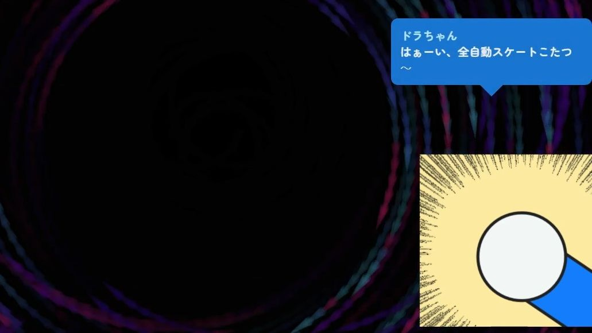

# どこでもドラちゃん Bot OmikujiBot 5percent_Dora

最終更新日：2025/11/21

配信者のためのコメントアプリ「わんコメ」で使用できる、 テンプレートです。

この内容は、BOOTH で配布している、 [どこでもドラちゃん Bot OmikujiBot 5percent_Dora](https://pintocuru.booth.pm/items/7291931) の readme となります。

## はじめに（Intro）

- [わんコメ](https://onecomme.com/) の機能を前提としたソフトウェアです。
- 本ソフトウェアの利用は自己責任でお願いいたします。
- 仕様は予告なく変更される場合があります。

## このテンプレートは何？（Features）

### 「ドラちゃん」を名乗るキャラクターが「ひみつ道具」をランダムに出してくれるジェネレーター

- わんコメに BOT 機能を付与するジェネレーター【おみくじ BOT】を使った、コメントや 3 分ごとに自動でつぶやいてくれる、テンプレートです。
- 古くから商売繁盛のシンボル「信楽たぬき」「仙台四郎」にあやかり、**現代の運試し＝ソーシャルゲームのガチャにおける縁起物**として人気の「ドラちゃん」を、あなたの手元でいつでも呼び出せるようにしました。
	- (上記の説明は実際とは異なります。[某有名 Bot](https://x.com/5percent_dora) を模したおみくじ BOT となります。非公式パロディです。)

### シーン別・活用例

- **雑談配信**
  - コメントで反応するので、配信が賑やかになります。
  - 「誰がボロンさせたか」も表示してくれます。
- **ゲーム配信**
  - ガチャ要素のあるソーシャルゲームで使えるかもしれません。
    - ガチャ結果に関しては責任を持ちません。

## インストール (Installation)

> テンプレートのインストールは、[わんコメ カスタムテンプレートの導入方法](https://github.com/Pintocuru/OmikenReadme/blob/main/docs/TemplateInstall/README.md) をご覧ください。

### アップグレード

> バージョンアップは [github](https://github.com/Pintocuru/OmikujiBot-Docs/releases/latest) にて配布しております。
> 現在のバージョンについては、コンフィグエディターを開くか、readme.txt でご確認下さい。

- **アップグレード手順**：
  1. リリースノートの下部にある「Assets」から、「OmikujiBot」と書かれたファイルをダウンロード
  2. ダウンロードしたファイルを解凍
  3. わんコメを開き、「テンプレート」画面から、アップグレードしたいテンプレートを選び、右側の「フォルダを開く」をクリック
  4. 念のため、フォルダ内の `omikujiData.js` を別の場所にバックアップ
  5. 解凍したファイルを、該当フォルダに上書き保存
  6. コンフィグエディターを起動し、バージョンが最新になっていることを確認
- **注意**：アップグレード後、一部設定がデフォルトに戻る場合があります。バックアップは必ず行って下さい。

### 【推奨】おみくじ BOT 演出用 WordParty2.0 の導入について

この【おみくじ BOT OmikujiBot】は、[おみくじBOT 演出用WordParty2.0](https://pintocuru.booth.pm/items/7670038) の演出を前提として作られています。この WordParty を導入することで、配信がより華やかで視覚的に楽しいものになります。

- キャラクターのセリフに、効果音やアニメーションが追加で表示されるように。
- おみくじの結果やじゃんけんの勝敗が、視覚的にわかりやすく表示されます。

詳しくは [おみくじ BOT 用 WordParty README](https://github.com/Pintocuru/OmikujiBot-Docs/blob/main/core/OmikenWordParty/README.md) をご覧ください。

## つかいかた (Usage)

### おみくじを発動させるには

- 配信で実際に使う前に、**わんコメのコメントテスターで動作確認**することをおすすめします。
- コメントテスターは、わんコメのメニューから「コメントテスター」を選択してご利用ください。
- OBS 等のストリーミング配信アプリに正しく導入されていれば、コメントに「おみくじ」などのキーワードを送信することで発動します。

### ドラちゃん

> 発動ワード : `ドラちゃん` / `どらちゃん` / `dorachan` / `5percent_dora`

- 「ドラちゃん」と呼ぶと、ひみつ道具をランダムで 1 つ出してくれます。
  - 「ボロン」した時は、ボロンさせたユーザー名が表示されます
- 3 分ごとに自動で出してくれますが、配信に支障が出る時は、止めておくと良いです。

## カスタマイズ（Customization）

### 「コンフィグエディター」で自由におみくじを編集できる

- すべての配布パッケージには、**コンフィグエディター**（おみくじデータ編集用アプリ）が付属しています。
- アプリと同じフォルダにある **`ConfigMaker.html`** を開くと起動できます。
- 配布パッケージの種類によっては、一部機能が制限または非表示になっている場合があります。
- 詳しくは [おみくじ BOT コンフィグエディター README](https://github.com/Pintocuru/OmikujiBot-Docs/blob/main/core/ConfigEditor/README.md) をご覧ください。
- おみくじの内容は、配信に合わせて自由にカスタマイズできます。
- パロディ・ネタ要素が強いため、発言や結果の責任はすべて自己責任でお願いします。
- 元ネタや BOT 本体の意図とは関係ありません。

## よくある質問 (FAQ)

> わんコメの機能については [よくある質問](https://onecomme.com/docs/faq) または [導入ガイド](https://onecomme.com/docs/guide) をご参照ください。

### システム関連

#### Q. ギフト・スパチャされた時にだけ発動させたい

#### Q. メンバー限定で発動させたい

#### Q. 1 日 1 回と、回数を制限したい

A: [おみくじ BOT コンフィグエディター](https://github.com/Pintocuru/OmikujiBot-Docs/blob/main/core/ConfigEditor/README.md) で設定が可能です。

#### Q.ドラえもんでしょ？

A: 違います。

## トラブルシューティング (Troubleshooting)

わんコメの機能については [トラブルシューティング](https://onecomme.com/docs/trouble-shooting) または [導入ガイド](https://onecomme.com/docs/guide) をご参照ください。

#### Q. 棒読みちゃんの音が鳴らない

#### Q. OBS 側で非表示にしていても、BOT のコメントが勝手に動いてしまう

#### Q. コメントでおみくじが反応しない

#### Q. おみくじが Youtube のコメントに反映されていない

#### Q. おみくじを連続で行うとコメントが反映されなくなる

A. [おみくじ BOT README トラブルシューティング](https://github.com/Pintocuru/OmikujiBot-Docs/tree/main/core/OmikujiBot#%E3%83%88%E3%83%A9%E3%83%96%E3%83%AB%E3%82%B7%E3%83%A5%E3%83%BC%E3%83%86%E3%82%A3%E3%83%B3%E3%82%B0-troubleshooting) をお読みください。

#### Q. WordParty の音が配信に出ない

わんコメ公式の [音声を配信にのせる方法](https://onecomme.com/docs/feature/wordparty#%E9%9F%B3%E5%A3%B0%E3%82%92%E9%85%8D%E4%BF%A1%E3%81%AB%E3%81%AE%E3%81%9B%E3%82%8B%E6%96%B9%E6%B3%95) をご覧ください

「はぁーい、どこでもしずちゃん～」

## ライセンス（License）

### パッケージデータ (通常版)

本データは既存コンテンツを元にした二次創作です。原作の権利は各権利者に帰属します。

以下の条件に従ってご利用ください：

- 非営利の範囲であれば、配信での使用・改変は自由です。
- YouTube や Twitch 等での収益化配信も、個人による非営利利用とみなします。
- 法人・企業による利用、パッケージの再配布・販売は禁止します。
- 改変の有無にかかわらず、データ含め再配布は禁止します。

### アプリ本体（ジェネレーター・コンフィグエディター）

- Copyright © 2025 Pintocuru(せすじピンとしてます)
- 本ソフトウェア (おみくじ BOT) は、著作権者の許可なく再配布することを禁じます。
- 本ソフトウェアは、Github、または BOOTH にて提供される各パッケージに含まれる形でのみ配布されます。
- 改変・逆コンパイル・再販売も禁止されています。

## バージョン情報 (Version)

### ver.250910

- おみくじ BOT のバージョン: v1.1.0

### ver.250816

- 「[おみくじ BOT](../../core/OmikujiBot/README.md)」を利用して、ガチャ配信向け BOT として新規公開しました

---

作成者：Pintocuru(せすじピンとしてます) @pintocuru

[Twitter](https://twitter.com/pintocuru) | [YouTube](https://www.youtube.com/@pintocuru)