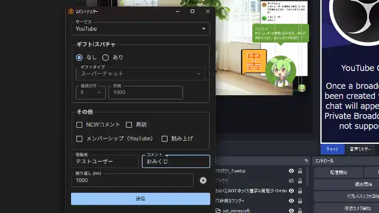

# おみくじ BOT ボンバースロット OmikujiBot BomberSpin README

最終更新日：2025/12/07

配信者のためのコメントアプリ「わんコメ」で使用できる、 テンプレートです。

この内容は、BOOTH で配布している、 [おみくじ BOT 超おみくじ OmikujiBot BigBangFortune](https://pintocuru.booth.pm/items/7440428) の readme となります。

## はじめに（Intro）

- [わんコメ](https://onecomme.com/) の機能を前提としたソフトウェアです。
- 本ソフトウェアの利用は自己責任でお願いいたします。
- 仕様は予告なく変更される場合があります。

## このテンプレートは何？（Features）

### 出玉で競え！めざせ最高枚数

- わんコメに BOT 機能を付与するジェネレーター【おみくじ BOT】を使った、数値の大きさで楽しむ、ミニゲーム系のジェネレーターです。
- 配信時、コメントに「スロット」と入力することで、配信画面にジングルが降り、得点がランダムで表示されるミニゲームが楽しめます。
- ランキング機能も搭載。1 位を目指しましょう！

### シーン別・活用例

- **朝活・雑談配信**
  - ミニゲームの内容をきっかけに話題を広げて、会話が途切れにくくなります。
  - ゲーム参加を目的にコメントしてくれるリスナーが増えることで、自然にコメント数や盛り上がりがアップします。

## インストール (Installation)

> テンプレートのインストールは、[わんコメ カスタムテンプレートの導入方法](https://github.com/Pintocuru/OmikenReadme/blob/main/docs/TemplateInstall/README.md) をご覧ください。

### アップグレード

> バージョンアップは [github](https://github.com/Pintocuru/OmikujiBot-Docs/releases/latest) にて配布しております。
> 現在のバージョンについては、コンフィグエディターを開くか、readme.txt でご確認下さい。

- **アップグレード手順**：
  1. リリースノートの下部にある「Assets」から、「OmikujiBot」と書かれたファイルをダウンロード
  2. ダウンロードしたファイルを解凍
  3. わんコメを開き、「テンプレート」画面から、アップグレードしたいテンプレートを選び、右側の「フォルダを開く」をクリック
  4. 念のため、フォルダ内の `omikujiData.js` を別の場所にバックアップ
  5. 解凍したファイルを、該当フォルダに上書き保存
  6. コンフィグエディターを起動し、バージョンが最新になっていることを確認
- **注意**：アップグレード後、一部設定がデフォルトに戻る場合があります。バックアップは必ず行って下さい。

### 【推奨】おみくじ BOT 演出用 WordParty2.0 の導入について

この【おみくじ BOT OmikujiBot】は、[おみくじBOT 演出用WordParty2.0](https://pintocuru.booth.pm/items/7670038) の演出を前提として作られています。この WordParty を導入することで、配信がより華やかで視覚的に楽しいものになります。

- キャラクターのセリフに、効果音やアニメーションが追加で表示されるように。
- おみくじの結果やじゃんけんの勝敗が、視覚的にわかりやすく表示されます。

詳しくは [おみくじ BOT 演出用 WordParty2.0 README](https://github.com/Pintocuru/OmikujiBot-Docs/blob/main/core/OmikenWordParty/README.md) をご覧ください。

## つかいかた (Usage)

### おみくじを発動させるには

- 配信で実際に使う前に、**わんコメのコメントテスターで動作確認**することをおすすめします。
- コメントテスターは、わんコメのメニューから「コメントテスター」を選択してご利用ください。
- OBS 等のストリーミング配信アプリに正しく導入されていれば、コメントに「おみくじ」などのキーワードを送信することで発動します。

### ボンバースロット

> 発動ワード : `スロット` / `すろっと`/ `slot`/ `ボンバー`/ `bomber`

- APPLI 「BOMBERSPIN2」 をイメージした、スロット風おみくじ。得点の高さを競います。
- ランクの高い図柄ほど高い得点に期待が持てます。
- 図柄は「チェリー」「オレンジ」「ぶどう」「スイカ」「ベル」「ハット」「コイン」「ダイヤモンド」の 8 つ。
	- 使える絵文字の関係上、プラム→ぶどう、BAR→コイン、セブン→ダイヤモンド に変更しています。
	- 「ダブルダウン」はありません。
- 突然の高得点！後半になるほど、高い得点が得られます。

### うさぎスロット

> 発動ワード : `うさぎ` / `ウサギ`/ `ドワーフ`/ `rabbit`/ `dwarf`/ `usagi`

- Nolimit City 「Fire in the Hole」 をイメージした、スロット風おみくじ。得点の高さを競います。
- うさぎ🐇が多いほど枚数獲得の期待大！
	- にんじん🥕が出るほど、うさぎが増える傾向にあります。雇ったのかな？
- コイン🪙、お札💴、ドル袋💰️、ダイヤモンド💎、TNT🧨・ツルハシ⛏️が飛び出るほど高得点！
- 上限は 5000 枚。目指せジャックポット！

### 桜吹雪スロット

> 発動ワード : `さくら` / `桜`/ `sakura`/ `桜吹雪`

- Wing 「FURAIJIN 風雷神」 をイメージした、スロット風おみくじ。得点の高さを競います。
- 図柄は「10(雨⛈️)」「J(月🌙)」「Q(竹🎍)」「K(波🌊)」「ACE(桜🌸)」「SSR(星🌟)」の 6 種類。
- 配当は非常に低いですが、掛け算により、指数的に得点が跳ね上がります。
- 花火が打ち上がるほど枚数獲得の期待大！
	- 枚数が多いほど、風神や雷神の出現率が上がります。
	- 上限達成で特別なキャラクターも…？
- 上限は 10000 枚。目指せジャックポット！

## カスタマイズ（Customization）

### 「コンフィグエディター」で自由におみくじを編集できる

- すべての配布パッケージには、**コンフィグエディター**（おみくじデータ編集用アプリ）が付属しています。
- アプリと同じフォルダにある **`ConfigMaker.html`** を開くと起動できます。
- 配布パッケージの種類によっては、一部機能が制限または非表示になっている場合があります。
- 詳しくは [おみくじ BOT コンフィグエディター README](https://github.com/Pintocuru/OmikujiBot-Docs/blob/main/core/ConfigEditor/README.md) をご覧ください。
- おみくじの内容は、あなたの配信に合わせて**内容を自由にカスタマイズ**できます。
- ただし、使用している**キャラクターには著作権があります**ので、原作やイラスト制作者の方々へのご配慮をお願いします。

## よくある質問 (FAQ)

> わんコメの機能については [よくある質問](https://onecomme.com/docs/faq) または [導入ガイド](https://onecomme.com/docs/guide) をご参照ください。

### システム関連

#### Q. ギフト・スパチャされた時にだけ発動させたい

#### Q. メンバー限定で発動させたい

#### Q. 1 日 1 回と、回数を制限したい

A: [おみくじ BOT コンフィグエディター](https://github.com/Pintocuru/OmikujiBot-Docs/blob/main/core/ConfigEditor/README.md) で設定が可能です。

## トラブルシューティング (Troubleshooting)

わんコメの機能については [トラブルシューティング](https://onecomme.com/docs/trouble-shooting) または [導入ガイド](https://onecomme.com/docs/guide) をご参照ください。

#### Q. 棒読みちゃんの音が鳴らない

#### Q. OBS 側で非表示にしていても、BOT のコメントが勝手に動いてしまう

#### Q. コメントでおみくじが反応しない

#### Q. おみくじが Youtube のコメントに反映されていない

#### Q. おみくじを連続で行うとコメントが反映されなくなる

A. [おみくじ BOT README トラブルシューティング](https://github.com/Pintocuru/OmikujiBot-Docs/tree/main/core/OmikujiBot#%E3%83%88%E3%83%A9%E3%83%96%E3%83%AB%E3%82%B7%E3%83%A5%E3%83%BC%E3%83%86%E3%82%A3%E3%83%B3%E3%82%B0-troubleshooting) をお読みください。

#### Q. WordParty の音が配信に出ない

わんコメ公式の [音声を配信にのせる方法](https://onecomme.com/docs/feature/wordparty#%E9%9F%B3%E5%A3%B0%E3%82%92%E9%85%8D%E4%BF%A1%E3%81%AB%E3%81%AE%E3%81%9B%E3%82%8B%E6%96%B9%E6%B3%95) をご覧ください

## クレジット（Credits）

WordParty で使用するものは、[おみくじBOT用WordParty クレジット・ライセンス](sub/OmikenWordPartyCredits.md) にまとめています。

#### 爆弾のキャラクター

- せすじピンとしてます
- 本アプリ専用に制作された画像です。他の用途での使用・転載・再配布は禁止します。

### 素材の取り扱いについて

1. 本アプリに含まれる素材は、各権利者からの許諾を得て使用しています。
2. 素材は、配信でのみ使用してください。抽出・再配布は禁止です。
3. 詳細は各配布サイトの利用規約をご参照ください。

## ライセンス（License）

### パッケージデータ

- このパッケージのデータ (JSON データ) は、改変・再利用は自由に行えます。
- ただし **再配布は禁止** とします。
- 本テンプレートの使用に伴ういかなる損害についても責任を負いません。ご利用は自己責任でお願いします。

### アプリ本体（ジェネレーター・コンフィグエディター）

- Copyright © 2025 Pintocuru(せすじピンとしてます)
- 本ソフトウェア (おみくじ BOT) は、著作権者の許可なく再配布することを禁じます。
- 本ソフトウェアは、Github、または BOOTH にて提供される各パッケージに含まれる形でのみ配布されます。
- 改変・逆コンパイル・再販売も禁止されています。

## バージョン情報 (Version)

### ver.250929-v1.4.2

- 新規作成

---

作成者：Pintocuru(せすじピンとしてます) @pintocuru

[Twitter](https://twitter.com/pintocuru) | [YouTube](https://www.youtube.com/@pintocuru)