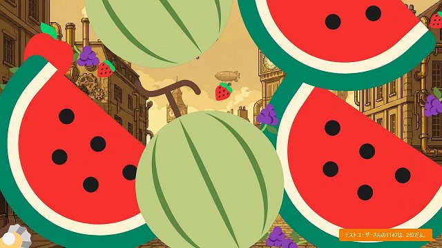

# おみくじ BOT スイカジェネレーター + カボチャ&クジラ OmikujiBot GouseiSuika README

最終更新日：<% tp.date.now('YYYY/MM/DD') %>

 テンプレートです。

この内容は、BOOTH で配布している、 [おみくじ BOT スイカジェネレーター +カボチャ&クジラ OmikujiBot GouseiSuika](https://pintocuru.booth.pm/items/5813323) の readme となります。

## このテンプレートは何？（Features）

### コメントでスイカゲーム風のおみくじを楽しめる

- コメントに「スイカ」と入力することで、配信画面にフルーツが降り、得点がランダムで表示されるミニゲームが楽しめます。
  - 得点は 1000 ～ 3000 点程度ですが、まれに 5000 点を超える高得点も出現します。
  - 降ってくるフルーツは演出です。くっついてもシンカはしません。
- 得点は読み上げられ、スイカゲーム風のスコア表示で **誰がどんな得点か** がわかります。
- プレイしたくなる!スコアランキング付き
  - 何度でもプレイ可能で、デフォルトでは最高 5 回までの記録が残ります。
  - リスナーからコメントが増える効果も期待できます
    - 同じコメントが多くなる場合もあります 💦

## つかいかた (Usage)

## カスタマイズ（Customization）

### スイカゲーム関連

#### Q. 落ちてくるフルーツの数と得点が合わない

A: フルーツの落下は演出です。実際の得点計算とは異なります。

#### Q. 「スイカゲーム」の最高得点は？

A: 極稀に 20000 点以上に達することも。理論上無制限です。

## クレジット（Credits）

WordParty で使用するものは、[おみくじBOT用WordParty クレジット・ライセンス](sub/OmikenWordPartyCredits.md) にまとめています。

- BOOTH 紹介画像のタイトルロゴのフォント
  提供元：ＫＦひま字ふで <https://www.kfstudio.net/font/kfhimajifude/>

## バージョン情報 (Version)

### ver.251205

- おみくじ BOT v1.4.3
- 新しい [おみくじ BOT 演出用 WordParty2.0](https://pintocuru.booth.pm/items/7670038) に対応完了
	- 時間がかかってしまい申し訳ありません
- 「スイカジェネレーター(カボチャ・クジラ含む)」の計算方法を変更
    - ランダムで x0.7-x1.3 していたものをやめました。
        - スイカは 1000 点なのですが、ランダムのせいで 700 点になったら違和感ありますもんね。
    - 元ゲームでは「ダブルスイカ」達成時、スイカがなくなりフィールドがクリアになりますが、それを再現する得点計算になりました。
        - これまでは 10000 超えは天文学的な数値でしたが、この変更で現実的な数値になりました。めったに出ませんが。
- 「スイカジェネレーター(カボチャ・クジラ含む)」の演出がおかしかったのを修正
    - 特にカボチャゲームの演出がおかしかったので、これが修正されました。

### ver.250816

- システムファイルを「[おみくじ BOT](/packages/OmikujiBot/core/OmikujiBot/README.md)」に移しました。
- メインのシステムをおみくじ BOT に任せたことにより、バージョン表記の変更を行いました。
  - セマンティック・バージョニング > 日付にしました。
- 以降、おみくじ内容が変化しない限りは、バージョンの表記は変化しません。
- 以上の経緯により、ランキングの見た目が変化しました。
  - 画像を使わない見た目になりました。
  - ランキング告知の際、読み上げを行わず、代わりにトースト表記にしました。
  - トースト表記の際、わんコメに投稿しなくなったので、ジェネレーターではランキングのコメントが表示されなくなります。
- 新版のおみくじ BOT を公開したため、旧版はサポートを終了し、無料で提供しています。
  - 旧版に含まれていた「占い」機能については、新版には引き継いでいません。

### v0.31 : 24/07/17

- 無料版/支援版で機能の差を付けました。
  - カボチャゲーム/クジラゲームは支援版のみに変更。
  - 新規機能「フルーツ占い」を入れました。こちらも支援版に入ってます。
- userData.js を編集するタイプに変更。
- 以下の機能を削除
  - 特定のユーザーを弾く機能 (わんコメのブロック機能で弾けるので)
  - 隠しモード「イカゲーム」(イカゲーム機能で遊ぶ場合は v0.3 をご利用下さい)
- 内部コードの仕様変更 (Vue2 から Vue3 になってます)

### v0.3 : 24/07/02

- 「ウェルカムおみくじ」の追加
- 「カボチャゲーム」「クジラゲーム」を追加
- ギフト/スパチャした場合のみ「スイカ」が可能になるスイッチを追加
- 特定のユーザーを弾く設定を追加
- 他細かい調整・改良

### v0.2 : 24/06/10

- 演出の調整、アイコン等の編集を行いました (弾ける効果音など)
- 今回のスコア + ユーザー名を表示するようにしました
- 「スイカ」のおみくじができる最大回数を追加

### v0.1 : 24/06/08

- 初版

<%* await tp.user.expandEmbeds(tp) %>
