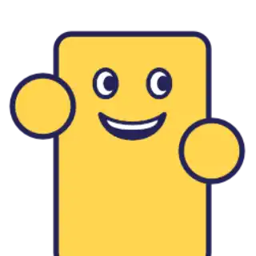
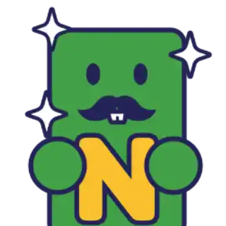

### カード駅

> 発動ワード : `カード` / `かーど`/ `card`/ `station`

|  |  |  |
| --------------------------------------- | --------------------------------------- | --------------------------------------- |

- 「桃太郎電鉄」の黄色いマスをモチーフにしたミニゲームです。
- 全国各地 (海外・地球外含む) でカード集めが楽しめます。
- 役職＋駅名＋1 種類～3 種類のカード（歴史ヒーロー含む）が手に入ります
	- 組み合わせはなんと約 64 兆 800 億通り!