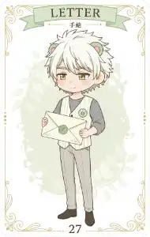
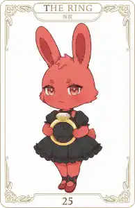
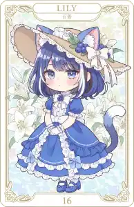

### ルノルマンカード

> 発動ワード : `ルノ` / `ルノマン`/ `カード`/ `Lenormand`/ `占い`

- 使用するカードは、ルノルマンカード全 36 枚。1 枚の象徴から、今の状況に寄り添うメッセージを受け取れる占い機能です。
	- 気軽に引けるのに、ちょっとしたヒントや気づきが得られることもあるかも。
	- [おみくじ BOT 用 WordParty](https://booth.pm/ja/items/6048048) を一緒に導入すると、稼働時にアニメーションが入ります。

|                                                         |                                                         |                                                         |
| ------------------------------------------------------- | ------------------------------------------------------- | ------------------------------------------------------- |
|  |  |  |
- カードのに描かれているキャラクターは「おみくじ BOT」のキャラクターです。左から下記のような名前です。
	- ヨーグル＝ソース
	- コーラ＝フロート
	- ミント＝シロップボトル