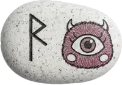
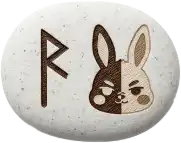

### ルーン占い

> 発動ワード : `ルーン` / `rune`/ `runic`/ `占い`

- 使用するのは、古代ゲルマン由来の **ルーン文字 24 種**。 ひとつのルーンが象徴する意味から、今のあなたに必要なヒントを受け取れる占い機能です。
	- シンプルに引けるので、状況整理や気持ちの切り替えに役立つ示唆が得られることも。
	- [おみくじ BOT 用 WordParty](https://booth.pm/ja/items/6048048) を一緒に導入すると、稼働時にアニメーションが入ります。

|  |  |  |
| --------------------------------------------------- | --------------------------------------------------- | --------------------------------------------------- |

- カードのに描かれているキャラクターは「おみくじ BOT」のキャラクターです。左から下記のような名前です。
	- ミント＝シロップボトル
	- マモノ (アサイーボール)
	- カペラテ＝フロート